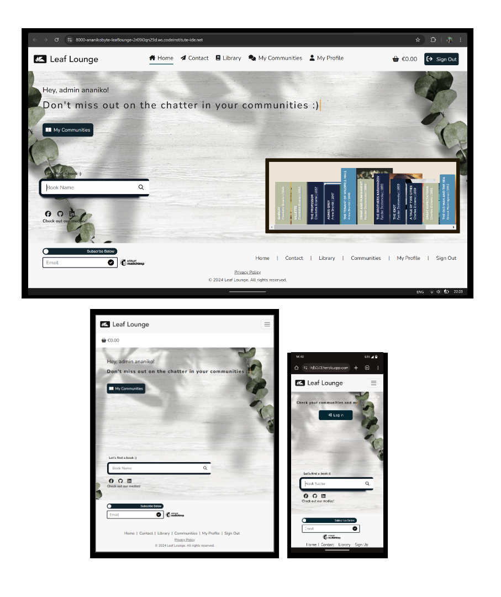
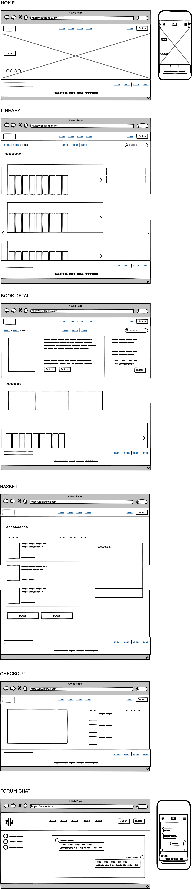
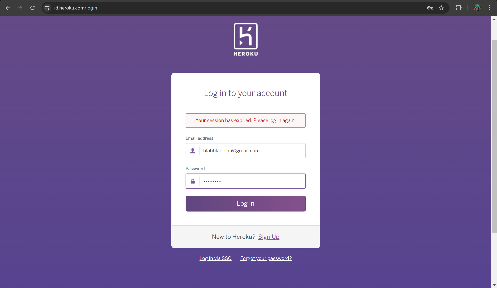
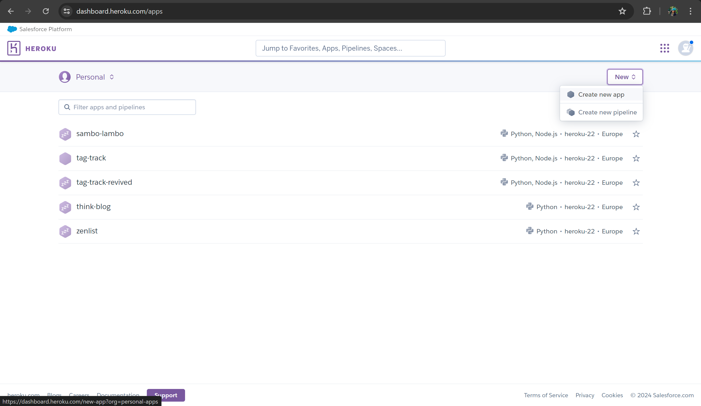
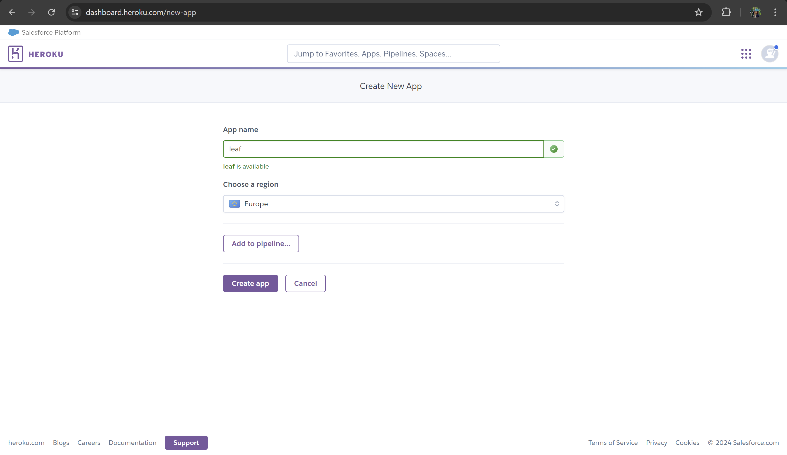
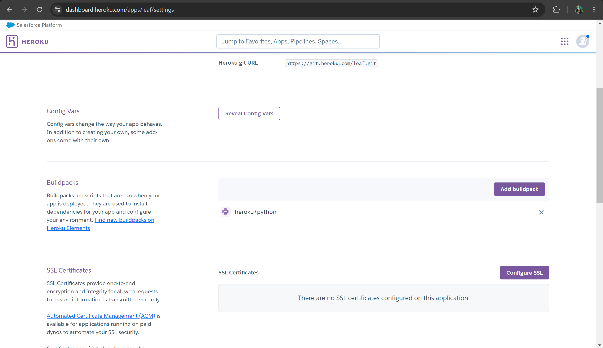
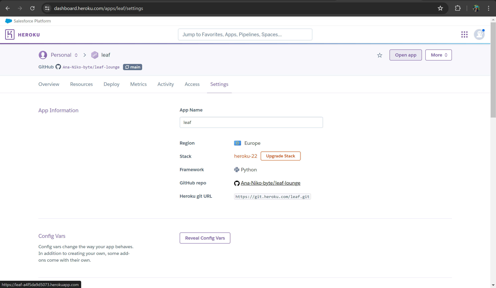

# `Leaf Lounge`
The application is available for viewing [here](https://leaf-a4f5da9d5073.herokuapp.com/).

>>> ## Introduction
Leaf Lounge book store and community hub is built with a `Django` backend - a high-level Python framework that encourages rapid development and clean code practices, and `Bootstrap5`, an extensive styling library. As a networking platform, Leaf Lounge offers book lovers the unique opportunity to connect and share impressions, reviews, and critiques of books. Visitors wishing to join one of Leaf Lounge's vast communities need only purchase a book and create an account to gain access to their personal profile, immediately gaining access to all Leaf Lounge has to offer. Additionally, registered users have the option of becoming a Leaf Lounge author by registering for an author profile and uploading their own published works to the Leaf Lounge library.

>>> ## SEO & Marketing
[MARKETING.md](https://github.com/Ana-Niko-byte/leaf-lounge/blob/main/docs/README_links/MARKETING.md)

>>> ## Table of Contents
- [Technology Stack](#technology-stack)
- [Feature Sneak Peek](#feature-sneak-peek)
- [Structure](#structure)
- [Wireframes](#wireframes)
- [User Stories](#user-stories)
- [Business/Social Goals](#businesssocial-goals)
- [UX Goals](#ux-goals)
- [Features](#features)
- [Models](#models)
- [Aesthetics](#aesthetics)
- [Testing & Debugging](#testing--debugging)
  - [Manual Testing](#manual-testing)
  - [Automated Testing](#automated-testing)
- [Issues](#issues)
- [Accessibility & Performance](#accessibility--performance)
  - [Lighthouse](#lighthouse)
  - [Colour Accessibility Validator](#colour-accessibility-validator)
  - [HTML Validation](#html-validation)
  - [CSS Validation](#css-validation)
  - [JSHint Validation](#jshint-validation)
- [Deployment](#deployment)
  - [Foreword](#foreword)
  - [Step 1: Create an App on Heroku](#step-1-create-an-app-on-heroku)
  - [Step 2: Connect to GitHub](#step-2-connect-to-github)
  - [Step 3: Automatic Deploy (Optional)](#step-3-automatic-deploy-optional)
  - [Step 4: Settings](#step-4-settings)
  - [Step 5: Deploy Your Masterpiece](#step-5-deploy-your-masterpiece)
  - [Step 6: Where is my Application?](#step-6-where-is-my-application)
- [Forking a GitHub Repository](#forking-a-github-repository)
- [Cloning a GitHub Repository](#cloning-a-github-repository)
- [Credits](#credits)

>>> ## Technology Stack
>> #### Backend
- `Django Framework` - fullstack technology.
- `Python` - Used for Django manipulation & interaction.

>> #### Database
- `PostgreSQL`
- `Amazon S3`

>> #### Frontend
- `HTML5/ Django Syntax` - Used for structuring and content.
- `CSS3` - Used for adding styles to the content for legibility and aesthetic appeal.
- `Bootstrap5` - For quick styling and pre-built component libraries.
- `Javascript` - For adding basic interactivity and dynamically setting URLs.
- `jQuery` - For adding basic interactivity and dynamically setting URLs.

>> #### Additional Technologies
- `FontAwesome` icons - used for icons.
- `Chrome Developer Tools` - used for debugging the website during production.
- `Lighthouse` - For performance, accessibility, best practices and SEO checking.
- `GitHub` - For code storage, version control and deployment.
- `Git` - For commiting through the terminal and pushing to GitHub for storage.
- `Gitpod` - The IDE I developed the project in.
- `VSC` - For quick testing of allauth functionality due to Gitpod's limitations.
- `Balsamiq` - For project wireframe design.
- `W3C Markup Validation Service` - to validate my HTML for potential errors.
- `W3C CSS Validation Service` - to validate my CSS code for potential errors.
- `Code Beautify` - to beautify CSS code.
- `JSHint` - for checking and validating my JS code. 
- `Pep8` - for Python code validation and best practices formatting.

>>> ## Feature Sneak Peek
- Advanced Book Filtering and Sorting
- Genre-Specific Communities and Forums
- Leave & Read Reviews
- Comprehensive E-COMMERCE
- Custom User Profile
- Become an Author
- Dedicated Customer Service

>>> ## Structure
[ARCHITECTURE.md](https://github.com/Ana-Niko-byte/leaf-lounge/blob/main/ARCHITECTURE.md)

>>> ## Wireframes

>>> ## User Stories
| Id | User Story | Label | Implemented |
| ----- | ----- | ----- | ----- |
| 1 | As a first time visitor, I would like to be taken directly to the 'Leaf Lounge' home page so that I have quick access to all relevant information to get started. | `must-have` |  |
| 2 | As a site user, it would be nice to have a contact page so that I could contact the 'Leaf Lounge' team with queries. | `should-have` |  |
| 3 | As a site visitor, I require access to the library page so that I can view and choose from available books. | `must-have` |  |
| 4 | As a site user, I would like the option to read more information on the book before buying it. | `must-have` |  |
| 5 | As a site user, I require the option of signing-up, signing-in and signing-out of my account. | `must-have` |  |
| 6 | As a site user, I would like a custom profile with my personal information. | `should-have` |  |
| 7 | As a site user, I require a checkout page from which I can make secure transactions. | `must-have` |  |
| 8 | As a site user, I would like access to Leaf Lounge's social media so that I could follow the page and stay up to date. | `good-to-have` |  |
| 11 | As a site visitor, I would like the option of signing up for the Leaf Lounge Newsletter, without needing to register for an account. | `must-have` |  |
| 14 | As a site user, I would like the option of viewing my books before buying them. | `should-have` |  |
| 15 | As a site user, I would like the option of amending my books before buying them. | `must-have` |  |
| 16 | As a site user, I would like the option of deleting books from my basket. | `must-have` |  |
| 17 | As a site user, I require a secure payment system to make transactions. | `must-have` |  |
| 27 | I would like the option of registering as an author and putting my work on Leaf Lounge so that I can get exposure within the communities. | `should-have` |  |
| 28 | As a site user, I require access to the chatroom so that I can network with other readers. | `must-have` |  |
| 29 | As a site user, I would like the option of viewing the books I have bought and storing them in my profile so that I can access the book communities and view my order history. | `must-have` |  |
| 30 | As a user, I would like the ability to search for a book so that I can quickly find the one I am looking for. | `should-have` |  |
| 31 | As a user, I require access to the book's genre community after making a purchase so I can network and engage with fellow book-enthusiasts. | `must-have` |  |
| 32 | As a user and community member, I would like the ability to leave reviews so new users can get feedback on a book prior to making purchase. | `must-have` |  |

>>> ## Business/Social Goals
[MARKETING.md](https://github.com/Ana-Niko-byte/leaf-lounge/blob/main/docs/README_links/MARKETING.md)

>>> ## UX Goals
- As a site user, I would like fast access to only the pages that would benefit my experience.
  -  All pages should be displayed based on whether I am registered/logged in.
  - I should be redirected to relevant pages and without coming across site errors.
- As a site user, I would like all pages to follow the same branding guidelines - this includes font family, colours (colour palette), image styles, spacing, and effects. I would also like colours to convey the correct emotions to ensure the intended branding message and motives.
- As a site visitor and/or potential reseller, I would like colours to convey the correct emotions to ensure the intended branding message and motives.
- As a site user, I would like all pages to be responsive to ensure I have a good user experience. This includes best practices in legibility, colour contrast, font sizes, branding, and element visibility.
- As a site user, if I am not provided with a success page, I need to be presented with a success message on the home page so I know my action was successful.
- As a site user, if I am not provided with an error page, I need to be presented with an error message on the home page so I know my action was unsuccessful.
- As a site user, I should be presented with a 404 page if the page I am looking for is unavailable, or a 500 page I made a bad request to the server with the option of returning to the home page.
- As a site user, I would like to be redirected to an error page if my financial transaction was unsuccessful. Alternatively, an error message should be provided.
- As a site user, I would like to be redirected to a success page so that I can be sure my financial transaction was successful. Alternatively, a success message should be provided.
- As a user, I want to be provided with good accessiblity and interaction on the site so that I can have a pleasant experience on the platform.

>>> ## Features
[ROADMAP.md](https://github.com/Ana-Niko-byte/leaf-lounge/blob/main/docs/README_links/ROADMAP.md)

>>> ## Models
[ARCHITECTURE.md](https://github.com/Ana-Niko-byte/leaf-lounge/blob/main/docs/README_links/ARCHITECTURE.md)

>>> ## Aesthetics
Leaf Lounge strives to recreate the experience of shopping in a bookstore by designing its library as a collection of shelves, with different height and colour books, split by genres. The colour `blue` is associated with wisdom, a common association with that of a library, thus is the main colour echoed throughout the site. Aesthetics outside of colours are kept to a minimum, with most of the books' appeal stemming from their cover images and effects.

The _shelves_ in the library use a combination of cold-brown tones to mimick wood, while the book-spine shades of dark blues and musky green compliment the timber-colours.

>>> ## Testing & Debugging
[TESTING.md](https://github.com/Ana-Niko-byte/leaf-lounge/blob/main/docs/README_links/TESTING.md)

>>> ## Accessibility & Performance
[TESTING.md](https://github.com/Ana-Niko-byte/leaf-lounge/blob/main/docs/README_links/TESTING.md)

>>> ## Deployment
The application is deployed on Heroku via a GitHub  connection, and is available for viewing in the link at the top of this README.md document. To deploy a Heroku project, please refer to the guide below.

### Foreword
There are some general requirements when it comes to setting up your application and its files: 
- Your dependencies must be placed in the requirements.txt file.
- You must strictly adhere to the correct folder structure expected by Django's settings.
- In Django's settings.py file, setting Debug = True in development will display a detailed errors page if the application comes across an error hindering template rendering. It will also allow the collection of static files (stylesheets, images, and javascript files automatically). Setting Debug = False will display standard error pages under the same conditions and will not update any changes to static files.

In Heroku, this is configured under `Config Vars` in the `Settings` tab.
> Note: Do not commit to GitHub with Debug = True. Always set Debug = False before committing to avoid exposing personal details.

> You will need two-factor verification set up to enable log in.

### Step 1: Create an App on Heroku
Log onto your Heroku dashboard using your username and password, and confirm the access code in the two-factor verification app of your choosing.

Login to Heroku:

Verify your Identity:

Create a new Heroku app:

You will be asked to pick a name and region for your app before clicking `Create app` on the next page.

### Step 2: Connect to GitHub
Once you've created your app, go to the `Deploy` tab at the top.

Select the middle box with GitHub's logo to connect your Heroku app to a GitHub Repository.

If prompted, authorize Heroku to access your GitHub account.
At the bottom, enter the name of the repository you wish to deploy to, and click Connect.

### Step 3: Automatic Deploy (Optional)
Under `Automatic Deploys`, choose a branch from your GitHub repository that Heroku will watch for changes.

Enable automatic deploys by clicking `Enable Automatic Deploys`. With this, every push to the selected branch will automatically deploy a new version of your app.

### Step 4: Settings
When you create the app, you will need to add the `heroku/python` buildpack in the `Settings` tab.

Add Heroku/Python Buildpack:

### Step 5: Deploy Your App
If you've enabled automatic deploys, any push to the selected branch will automatically deploy your application.

If you prefer to deploy manually or want to deploy a branch without enabling automatic deploys, go to `Manual deploy`, select the branch, and click `Deploy Branch`.

### Step 6: View The Application
Your application will have a similar look to the following Heroku URL configuration: `https://*.herokuapp.com` and can be found after clicking the `Open App` button on your dashboard in the top right corner.

>>> ## Forking a GitHub Repository
To make changes to your repository without changing its original state, you can make a copy of it via `fork`. This ensures the original repository remains unchanged. 

Steps:
1. Click into the GitHub repository you want to fork.
2. Click `Fork` in the top right-hand side of the top bar, and this should take you to a page titled `Create a new fork`.
3. You can now work in this copy of your repository without making changes to the original.

>>> ## Cloning a GitHub Repository
Cloning a repository essentially means downloading a copy of your repository that can be worked on locally. This method allows for version control and backup of code.

Steps:
1. Click on the GitHub repository you want to clone.
2. Click on the `Code` button.
3. Copy the link in the dropdown.
4. Open a terminal within your VSC (or whatever IDE you choose to use).
5. In the terminal type 'git clone' and paste the URL.
6. Press Enter - you now have a cloned version of your GitHub repository.

>>> ## Credits
- For help solving `Unsupported lookup 'icontains' for ForeignKey or join on the field not permitted.`: [stack overflow](https://stackoverflow.com/questions/76406530/i-am-getting-this-error-django-core-exceptions-fielderror-unsupported-lookup-i)

- For help solving `unsupported operand type(s) for |=: 'NoneType' and 'Q'` : [stack overflow](https://stackoverflow.com/questions/28201400/typeerror-unsupported-operand-types-for-bool-and-q)

- For initialising an `Q()` (wasn't sure on syntax): [stack overflow](https://stackoverflow.com/questions/44198266/django-how-to-check-if-q-object-is-empty)

- For setting up [Mailchimp Marketing](https://testdriven.io/blog/django-mailchimp/)
