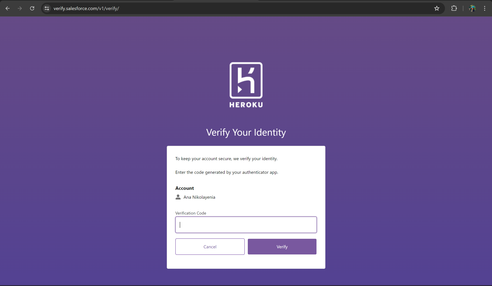

# `Leaf Lounge`
The application is available for viewing [here](https://moment-canvas-68ed5e5eed98.herokuapp.com/).

Also available for viewing here:
[Facebook Page](https://www.facebook.com/profile.php?id=61563390085042).

## Introduction
Leaf Lounge is built with `Django` - a high-level Python framework that encourages rapid development and clean code practices. As a book & networking platform, Leaf Lounge offers book lovers the unique opportunity to network and share impressions, reviews, and critiques of books. Visitors wishing to join one of Leaf Lounge's vast communities need only purchase a book and register a personal Leaf Lounge account, and they immediately gain access to all Leaf Lounge has to offer.

## Table of Contents
- [Technology Stack](#technology-stack)
- [Feature Sneak Peek](#feature-sneak-peek)
- [Structure](#structure)
- [Wireframes](#wireframes)
- [User Stories](#user-stories)
- [Strategy](#strategy)
- [Business/Social Goals](#businesssocial-goals)
- [UX Goals](#ux-goals)
- [Target Audience](#target-audience)
- [Key Information Deliverables](#key-information-deliverables)
  - [Client Side](#client-side)
  - [Technical](#technical)
  - [Marketing](#marketing)
- [Scope of Application](#scope-of-application)
- [Features](#features)
- [Models](#models)
- [Views & Templates](#views--templates)
- [Aesthetics](#aesthetics)
- [Testing & Debugging](#testing--debugging)
  - [Manual Testing](#manual-testing)
  - [Automated Testing](#automated-testing)
- [Issues](#issues)
- [Accessibility & Performance](#accessibility--performance)
  - [Lighthouse](#lighthouse)
  - [Colour Accessibility Validator](#colour-accessibility-validator)
  - [HTML Validation](#html-validation)
  - [CSS Validation](#css-validation)
  - [JSHint Validation](#jshint-validation)
- [Deployment](#deployment)
  - [Foreword](#foreword)
  - [Step 1: Create an App on Heroku](#step-1-create-an-app-on-heroku)
  - [Step 2: Connect to GitHub](#step-2-connect-to-github)
  - [Step 3: Automatic Deploy (Optional)](#step-3-automatic-deploy-optional)
  - [Step 4: Settings](#step-4-settings)
  - [Step 5: Deploy Your Masterpiece](#step-5-deploy-your-masterpiece)
  - [Step 6: Where is my Application?](#step-6-where-is-my-application)
- [Forking a GitHub Repository](#forking-a-github-repository)
- [Cloning a GitHub Repository](#cloning-a-github-repository)
- [Credits](#credits)
- [Acknowledgements](#acknowledgements)

## Technology Stack
#### Backend
- `Django Framework` - fullstack technology.
- `Python` - Used for Django manipulation & interaction.

#### Database
- `PostgreSQL`

#### Frontend
- `HTML5/ Django Syntax` - Used for structuring and content.
- `CSS3` - Used for adding styles to the content for legibility and aesthetic appeal.
- `Javascript` - For adding basic interactivity and dynamically setting URLs.

#### Additional Technologies
- `FontAwesome/Bootstrap` icons - used for icons.
- `Chrome Developer Tools` - used for debugging the website during production.
- `Lighthouse` - For performance, accessibility, best practices and SEO checking.
- `GitHub` - For code storage, version control and deployment.
- `Git` - For commiting through the terminal and pushing to GitHub for storage.
- `Gitpod` - The IDE I developed the project in.
- `VSC` - For quick testing of allauth functionality due to Gitpod's limitations.
- `Balsamiq` - For project wireframe design.
- `Color Contrast Accessibility Validator` - for checking colour contrast ratios.
- `W3C Markup Validation Service` - to validate my HTML for potential errors.
- `W3C CSS Validation Service` - to validate my CSS code for potential errors.
- `JSHint` - for checking and validating my JS code. 
- `Pep8` - for Python code validation and best practices formatting.

## Feature Sneak Peek
-
-
-
-
-
-
-
-
-

## Structure
- Navigation
  - Main Navigation Bar
    - Logo
    - Links
      - `Home`
      - `Contact`
      - `Library`
      - `My Communities` (if user is authenticated)
      - Basket
      - Authentication Links
        - `Sign Up` Button (if user is not authenthicated)
        - `Sign Out` Button (if user is authenticated)
  - Secondary Navigation Bar (visible only on some pages)
    - Breadcrumb Trail
    - Links
      - `My Books`
      - `My Profile`
      - `Become an Author`
    - Search Bar

- Home Page
  - Jumbotron
    - Welcoming Header
    - `Sign In` Button
  
___TBD___

- Contact Page
  - Contact POIs (visible on large screens only)
  - Contact Form
    - Validation
    - Messages-to-email-address
    - Success Message

- Library
  - Secondary Navigation Bar
  - All Books
    - `Read More` Button

- Book Detail Pages
  - Book View
  - `About the Author` Text
  - `Book Blurb`
  - Book Type Selection Field
    - Softcover
    - Hardcover
    - Epub
  - Quantity Input Field
    - Buttons
    - Validation
  - Buttons
    - `Return to Library`
    - `Add to Basket`
    - `Read Reviews`

- Basket
  - Content Table
    - Book
    - Price
    - Quantity
      - `Update Quantity` Button
        - Input Field
          - Delete Button
          - Increment Button
        - `Cancel` Button
        - `Save Changes` Button
    - Subtotal
  - Total Summary + Breakdown
  - `Keep Shopping` Button
  - `Secure Checkout` Button

- Checkout
  - Checkout Form
    - Stripe Card Input
  - Order Summary

- Reviews
- Community

- Footer
  - Links
    - `Home`
    - `Contact`
    - `Library`
    - `My Communities` (if user is authenticated)
    - Basket
    - Authentication Links
      - `Sign Up` Button (if user is not authenthicated)
      - `Sign Out` Button (if user is authenticated)
  - Newsletter
  - Copyright
    - Dynamic Year

## Wireframes

## User Stories
| Id | User Story | Label | User Story Testing |
| ----- | ----- | ----- | ----- |
| 1 | As a first time visitor, I would like to be taken directly to the 'Leaf Lounge' home page so that I have quick access to all relevant information to get started. | `must-have` | ----- |
| 6 | As a site user, I would like a custom profile with my personal information. | `should-have` | ----- |
| 3 | As a site visitor, I require access to the library page so that I can view and choose from available books. | `must-have` | ----- |
| 4 | As a site user, I would like the option to read more information on the book before buying it. | `must-have` | ----- |
| 2 | As a site user, it would be nice to have a contact page so that I could contact the 'Leaf Lounge' team with queries. | `should-have` | ----- |
| 7 | As a site user, I require a checkout page from which I can make secure transactions. | `must-have` | ----- |
| 28 | As a site user, I require access to the chatroom so that I can network with other readers. | `must-have` | ----- |
| 14 | As a site user, I would like the option of viewing my books before buying them. | `should-have` | ----- |
| 15 | As a site user, I would like the option of amending my books before buying them. | `must-have` | ----- |
| 16 | As a site user, I would like the option of deleting books from my basket. | `must-have` | ----- |
| 17 | As a site user, I require a secure payment system to make transactions. | `must-have` | ----- |
| 5 | As a site user, I require the option of signing-up, signing-in and signing-out of my account. | `must-have` | ----- |
| 11 | As a site visitor, I would like the option of signing up for the Leaf Lounge Newsletter, without needing to register for an account. | `must-have` | ----- |
| 8 | As a site user, I would like access to Leaf Lounge's social media so that I could follow the page and stay up to date. | `good-to-have` | ----- |
| 27 | As a book lover, I would like the option of putting my old books up for sale or donating them. | `should-have` | ----- |
| 29 | As a site user, I would like the option of viewing the books I have bought and storing them in my profile. | `should-have` | ----- |
| 30 | As a user, I would like the ability to search for a book so that I can quickly find the one I am looking for. | `should-have` | ----- |

## Strategy
This application aims to create an engaging and interactive environment for readers and book enthusiasts to connect, network and, subsequently, broaden the outreach of new authors within the various book communities. Several intuitive features in the navigation bar at the top of the page and considerable consideration given to the overall design and feel of the website make the user's experience quick, efficient, and satisfying.

## Business/Social Goals
- As a first time visitor, I would like to be taken directly to the 'Leaf Lounge' home page so that I have quick access to all relevant information to get started.
- As a site user, I would like a custom profile with my personal information.
- As a site user, I would like the option to read more information on the book before buying it.
- As a site visitor, I require access to the library page so that I can view and choose from available books.
- As a site user, it would be nice to have a contact page so that I could contact the 'Leaf Lounge' team with queries.
- As a site user, I require a checkout page from which I can make secure transactions.
- As a site user, I require access to the chatroom so that I can network with other readers.
- As a site user, I would like the option of viewing the books I have bought and storing them in my profile.
- As a site user, I would like the option of viewing my books before buying them.
- As a site user, I would like the option of amending my books before buying them.
- As a site user, I would like the option of deleting books from my basket.
- As a site user, I require a secure payment system to make transactions.
- As a site user, I require the option of signing-up, signing-in and signing-out of my account.
- As a site visitor, I would like the option of signing up for the Leaf Lounge Newsletter, without needing to register for an account.
- As a site user, I would like access to Leaf Lounge's social media so that I could follow the page and stay up to date.
- As a site user, I would like the ability to search for a book so that I can quickly find the one I am looking for.
- As a book lover, I would like the option of putting my old books up for sale or donating them.

## UX Goals
- As a site user, I would like fast access to only the pages that would benefit my experience.
  -  All pages should be displayed based on whether I am registered/logged in.
  - I should be redirected to relevant pages and without coming across site errors.
- As a site user, I would like all pages to follow the same branding guidelines - this includes font family, colours (colour palette), image styles, spacing, and effects. 
- As a site visitor and/or potential reseller, I would like colours to convey the correct emotions to ensure the intended branding message and motives.
- As a site user, I would like all pages to be responsive to ensure I have a good user experience. This includes best practices in legibility, colour contrast, font sizes, branding, and element visibility.

## Target Audience
- Readers
- Authors
- Publishers
- Book Critics
- Book Enthusiasts
- 15+ years of age (payment)

## Key Information Deliverables
For the purposes of document navigation, the key information deliverables for this project have been split into three sections, each focusing on a different vital aspect of the project.

#### Client-Side
- _Home page_ with all relevant information about the platform.
- _Checkout page_ with _Stripe_ Payments.
- Community Page
  - _Chatroom_
  - _Reviews_
- Creation of _Personal/Seller Profiles_ for audience expansion.

#### Technical
- _Contact page_ queries reaching Leaf Lounge _Email_.
- _Stripe_ Payments
- Testing files for all app views, urls, and models.

#### Marketing
- [Facebook Page](https://www.facebook.com/profile.php?id=61563390085042)
- Clear and intuative branding
- Legibility and responsiveness of all elements on all screen sizing

## Scope of Application
## Features

## Models
Below is a simple ERD for `moment`'s models.

#### The Author Model (library app)
Fields: `first_name`, `last_name`, `d_o_b`, `nationality`, `bio`

1. `first_name` : CharField - represents the author's firstname.
- Constraints: 
  - _max-length_ of 20 characters.

2. `last_name` : CharField - represents the author's lastname.
- Constraints: 
  - _max-length_ of 20 characters.

3. `d_o_b` : DateField - represents the author's date of birth.
- Constraints: 
  - _default_ value of 'unknown'.
  - _verbose-name_ of 'BirthDate'.

4. `nationality` : CharField : choices - represents a selection field for the author's nationality.
- Constraints: 
  - predefined _choices_ from `NATIONALITIES` tuple.
  - _max-length_ of 30 characters.

5. `bio` : TextField - represents the author's bio.
- Constraints: 
  - _max-length_ of 500 characters.

###### Methods:
`def __str__():` Returns : (str) : '(author's first name) (author's last name)'.

---

#### The Book Model (library app)
Fields: `title`, `isbn`, `slug`, `author`, `genre`, `blurb`, `year_published`, `publisher`, `rating`, `type`, `date_added`, `price`, `image`

1. `title` : CharField - represents the book title.
- Constraints:
  - _max-length_ of 100 characters.

2. `isbn` : CharField - represents the book's Internation Standard Book Number.
- Constraints:
  - _max-length_ of 13 characters (all books after 2007 are 13 digits long, all before are 10 digits long).

3. `slug` : SlugField - represents the book slug (name-author fields).
- Constraints:
  - _max-length_ of 100 characters.
  - Can be left _blank_.
  - Can be _null_.
  - Has _help text_ to explain why it can be left _blank_ and may be _null_.

4. `author` : FK : Author - represents the author of the book.

5. `genre` : CharField : choices - represents the book genre.
- Constraints:
  - predefined _choices_ from `GENRES` tuple.
  - _max-length_ of 50 characters.

6. `blurb` : TextField - represents the book blurb.
- Constraints:
  - _max-length_ of 500 characters.

7. `year_published` : IntegerField - represents the year the book was published.
- Constraints:
  - _MaxValueValidator_ : 2024.

8. `publisher` : CharField - represents the book publisher.
- Constraints:
  - _max-length_ of 100 characters.

9. `rating` : DecimalField - represents the book rating (out of 10).
- Constraints:
  - _decimal-places_ : 2.
  - _MinValueValidator_ of 0.01 with message.
  - _max-digits_ : 3.

10. `type` : CharField - represents the book cover type.

11. `date_added` : DateField - represents the date the book was added to the database.
- Constraints:
  - Adds current date.

12. `price` : DecimalField - represents the book price.
- Constraints:
  - _decimal-places_ : 2.
  - _max-digits_ : 5.

13. `image` : ImageField - represents the book cover image.
- Constraints:
  - Can be left _blank_.
  - Can be _null_.

###### Methods:
`def __str__():` Returns "(book title)" by (book author).

`def save():`
  try:
      Saves the concatenated `slug`.
      Additionally checks if the title of the book has been changed (if it no longer matches the one in the db).
      If true - re-saves the slug to match the new title-author concatenation.
  except `Book.DoesNotExist`:
      Catches the `DoesNotExist` error and saves the model as a new instance. This error was encountered when attempting to perform a similar action in a previous project.

`def get_absolute_url():` returns the absolute url with the book 'slug' paramter (detail page).

###### Meta:
Orders by earliest date added.

---

#### The Order Model (checkout app)
Fields: `order_number`, `full_name`, `email`, `phone_number`, `country`, `postcode`, `town_city`, `street_1`, `street_2`, `county`, `date`, `delivery_cost`, `order_total`, `grand_total`

1. `order_number` : CharField - represents the auto-generated uuid order number.
- Constraints:
  - _max-length_ of 32 characters.
  - can not be _null_.
  - non-editable.

2. `full_name` : CharField - represents the full name associated with the order.
- Constraints:
  - _max-length_ of 50 characters.
  - can not be _null_.
  - can not be _blank_.

3. `email` : EmailField - represents the email associated with the order.
- Constraints:
  - _max-length_ of 254 characters.
  - can not be _null_.
  - can not be _blank_.

4. `phone_number` : CharField - represents the phone number associated with the order.
- Constraints:
  - _max-length_ of 20 characters.
  - can not be _null_.
  - can not be _blank_.

5. `country` : CharField - represents the country to which the order is to be posted.
- Constraints:
  - _max-length_ of 40 characters.
  - can not be _null_.
  - can not be _blank_.

6. `postcode` : CharField - represents the postcode associated with the order address.
- Constraints:
  - _max-length_ of 20 characters.
  - can be _null_.
  - can be _blank_.

7. `town_city` : CharField - represents the town/city to which the order is to be posted.
- Constraints:
  - _max-length_ of 40 characters.
  - can not be _null_.
  - can not be _blank_.

8. `street_1` : CharField - represents the first address line on the order.
- Constraints:
  - _max-length_ of 80 characters.
  - can not be _null_.
  - can not be _blank_.

9. `street_2` : CharField - represents the second address line on the order.
- Constraints:
  - _max-length_ of 80 characters.
  - can be _null_.
  - can be _blank_.

10. `county` : CharField - represents the county to which the order is to be posted.
- Constraints:
  - _max-length_ of 80 characters.
  - can be _null_.
  - can be _blank_.

11. `date` : DateTimeField - represents the date the order was placed.
- Constraints:
  - Adds current date.

12. `delivery_cost` : DecimalField - represents the delivery cost associated with the order.
- Constraints:
  - _max-digits_: 6.
  - _decimal-places_: 2.
  - can not be _null_.
  - _default_: 0

13. `order_total` : DecimalField - represents the total associated with the price/book and quantity.
- Constraints:
  - _max-digits_: 10.
  - _decimal-places_: 2.
  - can not be _null_.
  - _default_: 0.

14. `grand_total` : DecimalField - represents the order_total + delivery_cost.
- Constraints:
  - _max-digits_: 10.
  - _decimal-places_: 2.
  - can not be _null_.
  - _default_: 0.

###### Methods:
`def _generate_uuid_order_number():` Generates a random, unique order number using UUID.

`def save():`
  try:
      Asserts whether an order number exists.
      Saves a new `order_number` from def _generate_uuid_order_number().
  except Order.DoesNotExist:
      Catches the DoesNotExist error and saves the model as a new
      instance.

`def update_order_total():`
  Updates `order_total`, `delivery_cost`, and `grand_total` based on order_total and quantity.
  Asserts whether the `order_total` is above the `FREE_DELIVERY_THRESHOLD`, as defined in settings.py.
  If above, assigns 0 to `delivery_cost`.
  If below, assigns 10% of `order_total` value as `delivery_cost`.
  Assigns `grand_total` the sum of `order_total` + `delivery_cost`.

`def __str__():` Returns : (int) : order number.

---

#### The BookLineItem Model (checkout app)
Fields: `order`, `book`, `type`, `quantity`, `book_order_cost`

1. `order` : FK : Order - represents the book order.
- Constraints:
  - can not be _null_.
  - can not be _blank_.
  - _on-delete_: _models.CASCADE_.
  - _related-name_: _'booklineitem'_.

2. `book` : FK : Book - represents the book instance that was ordered.
- Constraints:
  - can not be _null_.
  - can not be _blank_.
  - _on-delete_: _models.CASCADE_.

3. `type` : CharField - represents the book cover type.
- Constraints:
  - _max-length_ of 9 characters.
  - can not be _null_.
  - can not be _blank_.

4. `quantity` : IntegerField - represents the quantity that was ordered.
- Constraints:
  - can not be _null_.
  - can not be _blank_.
  - _default_: 0.

5. `book_order_cost` : DecimalField - represents the total cost for the book order instance.
- Constraints:
  - _max-digits_: 5.
  - can not be _null_.
  - can not be _blank_.
  - _decimal-places_: 2.
  - non-editable.

###### Methods:
  `def save():` Assigns the total lineitem cost based on price/unit and quantity if not already assigned.

  `def __str__():` Returns : (str) : 'ISBN: (book ISBN), order: (order number uuid)'.

## Views & Templates
## Aesthetics

## Testing & Debugging
This section outlines procedures for manual testing. For automated testing, please see all files `test*.py`.

- ## Manual Testing
| Feature | Expected Outcome | Testing Procedure | Result | Remark |
|---|---|---|---|---|

- ## Automated Testing

## Issues
1. ### Contact Page ConnectionRefusedError

The error was encountered when attempting to send emails from the contact page. Instead of redirecting users to the home page with a success message, the application would throw the 500 Server Error page, and the email wouldn't reach the recipients' addresses.

###### Solution
As it happened, the issue was down to a simple typo in the following line in `blurb/views.py`: `recipient_list=[settings.EMAIL_HOST_USER, f'{email}'],` - the misplaced comma at the end. This syntax rendered the `recipient_list` as an invalid value in the `send_mail()` method, thus throwing the method and redirecting users to the 500 server error page. Removing the comma and saving the file resolved this issue. Testing and eventual resolution were done in `VS Code` by cloning the repository and debugging the relevant code due to Gitpod permissions and limitations.

## Accessibility & Performance
### Lighthouse
### Colour Accessibility Validator
### HTML Validation
### CSS Validation
### JSHint Validation
All js files are regularly validated during development using [JSHint](https://jshint.com/).

### Pep8 Validation
All python files are regularly validated during development using the [Code Institute PEP8 Linter](https://pep8ci.herokuapp.com/).

## Deployment
The application is deployed on Heroku via a GitHub  connection, and is available for viewing in the link at the top of this README.md document. To deploy a Heroku project, please refer to the guide below.

### Foreword
There are some general requirements when it comes to setting up your application and its files: 
- Your dependencies must be placed in the requirements.txt file.
- You must strictly adhere to the correct folder structure expected by Django's settings.
- In Django's settings.py file, setting Debug = True in development will display a detailed errors page if the application comes across an error hindering template rendering. It will also allow the collection of static files (stylesheets, images, and javascript files automatically). Setting Debug = False will display standard error pages under the same conditions and will not update any changes to static files.

In Heroku, this is configured under `Config Vars` in the `Settings` tab.
_Note: Do not commit to GitHub with Debug = True. Always set Debug = False before committing to avoid exposing personal details._

You will need two-factor verification set up to enable log in.

### Step 1: Create an App on Heroku
Log onto your Heroku dashboard using your username and password, and confirm the access code in the two-factor verification app of your choosing.

Login to Heroku:

Verify your Identity:

Create a new Heroku app:

You will be asked to pick a name and region for your app before clicking `Create app` on the next page.

### Step 2: Connect to GitHub
Once you've created your app, go to the `Deploy` tab at the top.

Select the middle box with GitHub's logo to connect your Heroku app to a GitHub Repository.

If prompted, authorize Heroku to access your GitHub account.
At the bottom, enter the name of the repository you wish to deploy to, and click Connect.

### Step 3: Automatic Deploy (Optional)
Under `Automatic Deploys`, choose a branch from your GitHub repository that Heroku will watch for changes.

Enable automatic deploys by clicking `Enable Automatic Deploys`. With this, every push to the selected branch will automatically deploy a new version of your app.

### Step 4: Settings
When you create the app, you will need to add the `heroku/python` buildpack in the `Settings` tab.

Add Heroku/Python Buildpack:

### Step 5: Deploy Your App
If you've enabled automatic deploys, any push to the selected branch will automatically deploy your application.

If you prefer to deploy manually or want to deploy a branch without enabling automatic deploys, go to `Manual deploy`, select the branch, and click `Deploy Branch`.

### Step 6: View The Application
Your application will have a similar look to the following Heroku URL configuration: `https://*.herokuapp.com` and can be found after clicking the `Open App` button on your dashboard in the top right corner.

## Forking a GitHub Repository
To make changes to your repository without changing its original state, you can make a copy of it via `fork`. This ensures the original repository remains unchanged. 

Steps:
1. Click into the GitHub repository you want to fork.
2. Click `Fork` in the top right-hand side of the top bar, and this should take you to a page titled `Create a new fork`.
3. You can now work in this copy of your repository without making changes to the original.

## Cloning a GitHub Repository
Cloning a repository essentially means downloading a copy of your repository that can be worked on locally. This method allows for version control and backup of code.

Steps:
1. Click on the GitHub repository you want to clone.
2. Click on the `Code` button.
3. Copy the link in the dropdown.
4. Open a terminal within your VSC (or whatever IDE you choose to use).
5. In the terminal type 'git clone' and paste the URL.
6. Press Enter - you now have a cloned version of your GitHub repository.

## Credits
- For help solving `Unsupported lookup 'icontains' for ForeignKey or join on the field not permitted.`: [stack overflow](https://stackoverflow.com/questions/76406530/i-am-getting-this-error-django-core-exceptions-fielderror-unsupported-lookup-i)

- For help solving `unsupported operand type(s) for |=: 'NoneType' and 'Q'` : [stack overflow](https://stackoverflow.com/questions/28201400/typeerror-unsupported-operand-types-for-bool-and-q)

- For initialising an `Q()` (wasn't sure on syntax): [stack overflow](https://stackoverflow.com/questions/44198266/django-how-to-check-if-q-object-is-empty)

## Acknowledgements