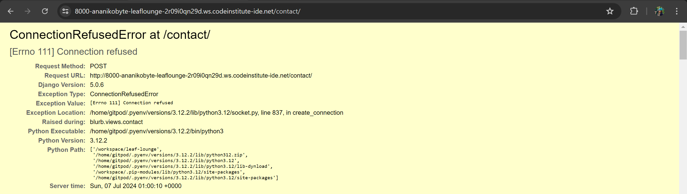

## Testing & Debugging
This section outlines procedures for manual testing. For automated testing, please see all files `test*.py`.

- ## Manual Testing
| Feature | Expected Outcome | Testing Procedure | Result | Remark |
|---|---|---|---|---|

- ## Automated Testing

## Issues
1. ### Contact Page ConnectionRefusedError

The error was encountered when attempting to send emails from the contact page. Instead of redirecting users to the home page with a success message, the application would throw the 500 Server Error page, and the email wouldn't reach the recipients' addresses.

###### Solution
As it happened, the issue was down to a simple typo in the following line in `blurb/views.py`: `recipient_list=[settings.EMAIL_HOST_USER, f'{email}'],` - the misplaced comma at the end. This syntax rendered the `recipient_list` as an invalid value in the `send_mail()` method, thus throwing the method and redirecting users to the 500 server error page. Removing the comma and saving the file resolved this issue. Testing and eventual resolution were done in `VS Code` by cloning the repository and debugging the relevant code due to Gitpod permissions and limitations.

## Accessibility & Performance
### Lighthouse
### Colour Accessibility Validator
### HTML Validation
### CSS Validation
### JSHint Validation
All js files are regularly validated during development using [JSHint](https://jshint.com/).

### Pep8 Validation
All python files are regularly validated during development using the [Code Institute PEP8 Linter](https://pep8ci.herokuapp.com/).