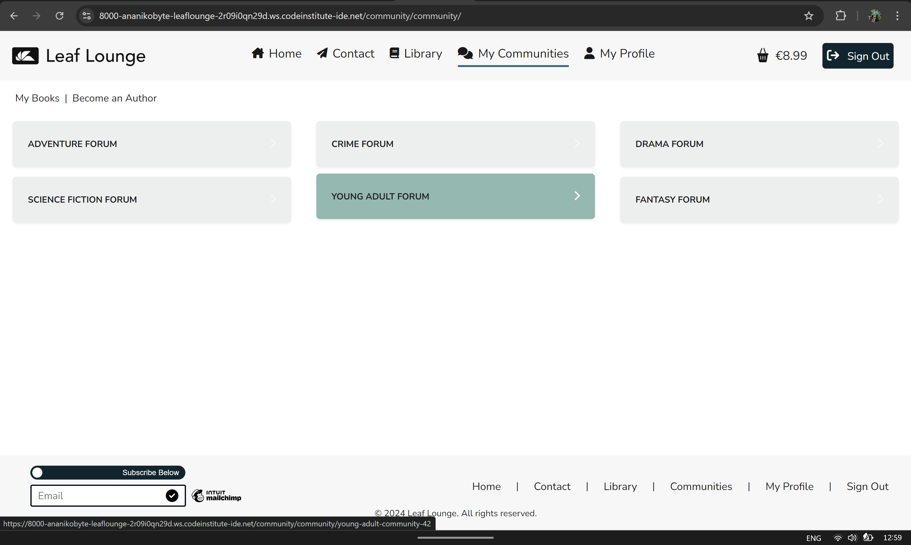

>>> ## Features
Below is a detailed overview of [`Leaf Lounge`](https://leaf-a4f5da9d5073.herokuapp.com/) features and capabilities.

>> #### Advanced Book Filtering and Sorting
- Library

The `library` page displays all books available for purchase. By default, books are sorted into rows based on their genre, i.e., all books belonging to the _'adventure'_ genre are put into their own carousel, and users can scroll this carousel to browse books in that specific genre.

Default Library Books View -

To enable further sorting and filtering, books may be filtered by `title` or by `author`, using the filtering system on the left-hand side of the page. If filtering is applied, a button displays at the top of each response page which clicked redirects users to the default view (all books in their respective genre carousels).

Filtered Books -

Furthermore, users may search for books using the search input in the secondary navigation bar. The response view will display all books matching the query.

Search Books (Before) -

Search Books (After) -

>> #### Genre-Specific Communities and Forums
- Communities

After users make a purchase, they gain access to their books' genre's community and community forum through the `My Communities` tab in the main navigation.
> This tab is only available to registered users.

This page is a space for like-minded indiviuals and book lovers to come together, connect, review, critique, and chat. Each genre with books available for purchase on the `library` page has a dedicated community. Users may belong to more than one community at any given time, provided they have bought a book from that genre.

Genres and Communities currently available:
- `Adventure` - _Adventure Community_
- `Art` - _Art Community_
- `Autobiography` - _Autobiography Community_
- `Biography` - _Biography Community_
- `Business` - _Business Community_
- `Children's` - _Children's Community_
- `Classics` - _Classics Community_
- `Comics` - _Comics Community_
- `Contemporary` - _Contemporary Community_
- `Crime` - _Crime Community_
- `Drama` - _Drama Community_
- `Dystopian` - _Dystopian Community_
- `Economics` - _Economics Community_
- `Education` - _Education Community_
- `Fantasy` - _Fantasy Community_
- `Self-Help` - _Self-Help Community_
- `Historical Fiction` - _Historical Fiction Community_
- `History` - _History Community_
- `Horror` - _Horror Community_
- `Humor` - _Humor Community_
- `LGBTQ+` - _LGBTQ+ Community_
- `Literary Fiction` - _Literary Fiction Community_
- `Magic Realism` - _Magic Realism Community_
- `Memoir` - _Memoir Community_
- `Music` - _Music Community_
- `Mystery` - _Mystery Community_
- `Non-Fiction` - _Non-Fiction Community_
- `Paranormal` - _Paranormal Community_
- `Philosophy` - _Philosophy Community_
- `Poetry` - _Poetry Community_
- `Psychology` - _Psychology Community_
- `Religion` - _Religion Community_
- `Romance` - _Romance Community_
- `Science` - _Science Community_
- `Science Fiction` - _Science Fiction Community_
- `Short Stories` - _Short Stories Community_
- `Suspense` - _Suspense Community_
- `Thriller` - _Thriller Community_
- `Travel` - _Travel Community_
- `True Crime` - _True Crime Community_
- `Western` - _Western Community_
- `Young Adult` - _Young Adult Community_

User Communities Page - 

Specific Community Page -

Chat Page-

>> #### Leave & Read Reviews
- Read Reviews

Each book's detail view displays information about the book, including, but not limited to: the book blurb, author bio, publisher, date the book was published on, price, and functionality for adding the book to the user's basket. Reviews are displayed on the right hand side of the page, with relevant sorting capability incorporated so users can quickly and easily find the type of reviews they are looking for.

Book Detail Reviews - 

- Leave a Review

Additionally to being able to view reviews, registered users, who have purchased the book, may leave a review under the `My Books` tab. This review requires admin approval prior to being displayed on the main page, but users may view their pending reviews in `My Reviews` under the `My Profile` tab _(My Profile > My Reviews)_.

Where to Access -

Leave Review -

User Profile Pending Review - 

Admin Review Access -

Approved Review -

>> #### Comprehensive E-COMMERCE
- The Checkout View & Secure Stripe Payments

Users wishing to place an order are navigated to the checkout view, where they are presented with a quick order overview, and a form to fill out their information. For first time users, billing information, such as their name, phone number, email, and address, needs to be filled out manually, but registered users can save their information to their profile for faster checkouts by ticking the `Save Info` box under the form. This information is available for amendments in `My Billing` under the `My Profile` tab _(My Profile > My Billing)_.

The Checkout View -

`Stripe` was used to provide users with a secure and accessible payments system for completing their orders. In case of errors, the form does not submit, and displays all relevant information helping users fill out their information correctly and in the expected format. After successful order placement, users are redirected to an Order Confirmation page, where they are presented with their billing information and an order summary.

The Order Confirmation Page -

- Order History

Registered Users can access their order history in `My Orders` under the `My Profile` tab _(My Profile > My Orders)_. A table with all of the user's orders displays, with each row being an accordion with a button to toggle the display the shipping information associated with the order.

Order History Closed Accordion -

Order History Open Accordion -

- Order Confirmation

After placing an order, users are sent an order confirmation email to the email address they indicated for the order, containing the order number, shipping information, and expected delivery timeframe.

Order Confirmation Email -

>> #### Custom User Profile
- My Billing

For first time users, billing information, such as their name, phone number, email, and address, needs to be filled out manually, but registered users can save their information to their profile for faster checkouts by ticking the `Save Info` box under the form. This information is available for amendments and the most recent information will be auto-filled into the checkout form. If there is no saved information, the fields will render empty in the `My Billing` section.

My Billing Filled -

My Billing Empty - 

- My Orders

A table with all of the user's orders displays, with each row being an accordion with a button to toggle the display the shipping information associated with the order.

> Please review the `Comprehensive E-Commerce` section for more information.

- My Communities

This is a button that redirects users to the `My Communities` general view, and encompasses the same functionality as outlined in [Genre-Specific Communities and Forums](#genre-specific-communities-and-forums).

- My Reviews

Additionally to being able to view reviews, registered users, who have purchased the book, may leave a review in their respective genre community. This review requires admin approval prior to being displayed on the main page, but users may view their pending reviews under this section. If a user is also an admin, they can directly approve the review from this page.

> Please review the `Leave and Read Reviews` section for more information.

- Help

This is a button that redirects users to the `Contact` page.
> Please review the `Dedicated Customer Service` section for more information.

>> #### Become an Author
- Become an Author (Secondary Navigation Bar)

The `Become an Author` tab in the secondary navigation bar allows registered users to create a Leaf Lounge author profile, from which users can register their own works and display them in the leaf Lounge library. This addition provides exposure to new and aspiring authors within communities of book-enthusiasts. There are two forms in this section - one for registering users (or finding existing profiles), and one for registering books. After registering their book, users are redirected inside the `My Books` tab (also in the secondary navigation bar), where they can view their registered and purchased books.

- Become an Author

- Register a Book

- User Books

>> #### Dedicated Customer Service
- Contact

The `Contact` page displays a form for users to contact the customer support team to handle all queries. A field with the label of `Subject: *` asks users to select a category for which to file the query. The message gets sent to the company email address, with a copy forwarded to the user. A toast confirmation message displays telling the user whether their request was successful, or to try again at a later date.

Example Email Sent -

Toast Message -
