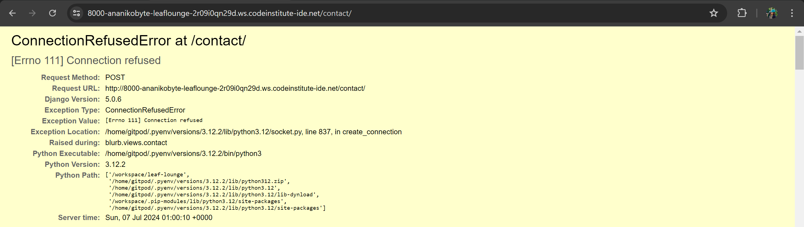
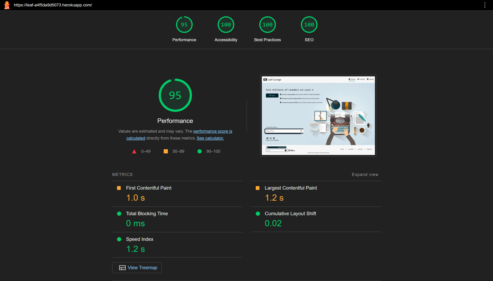
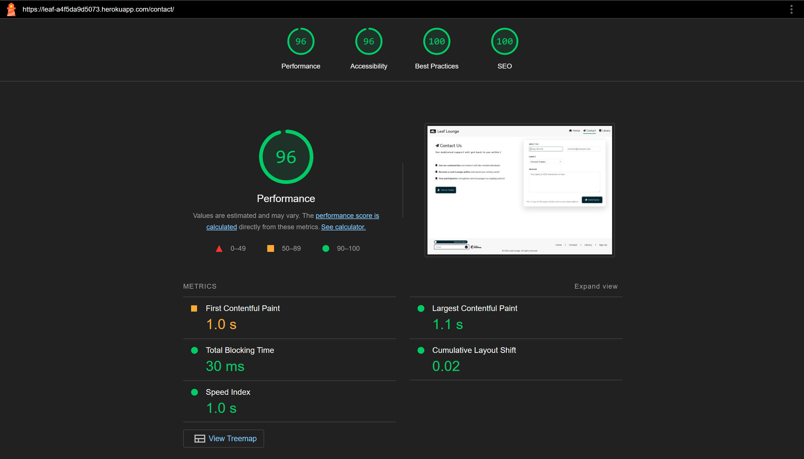
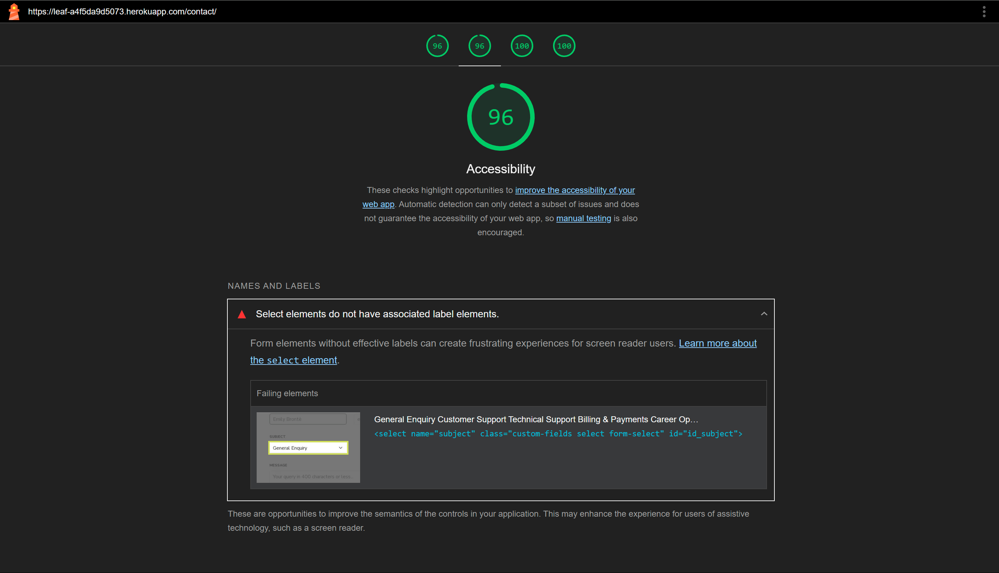
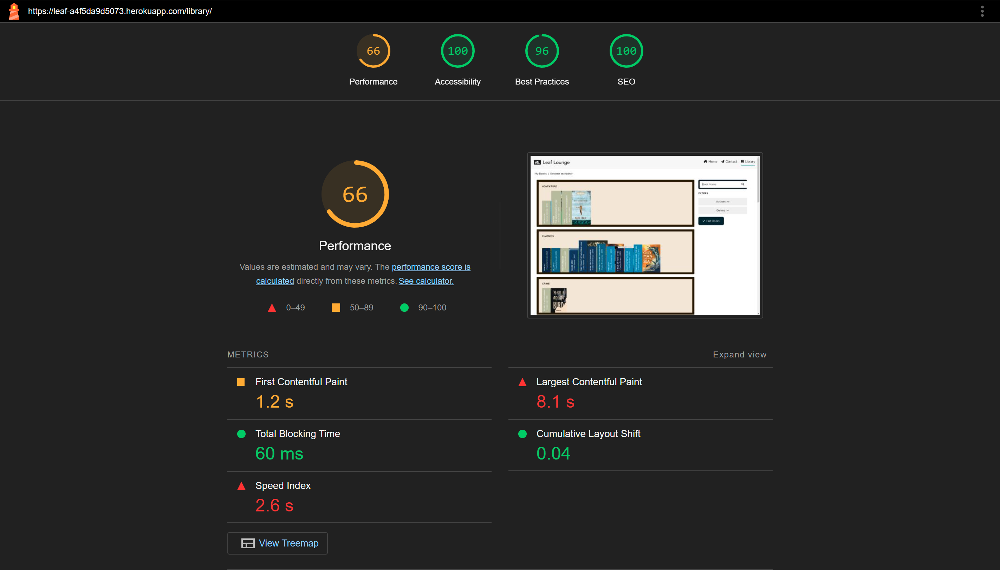
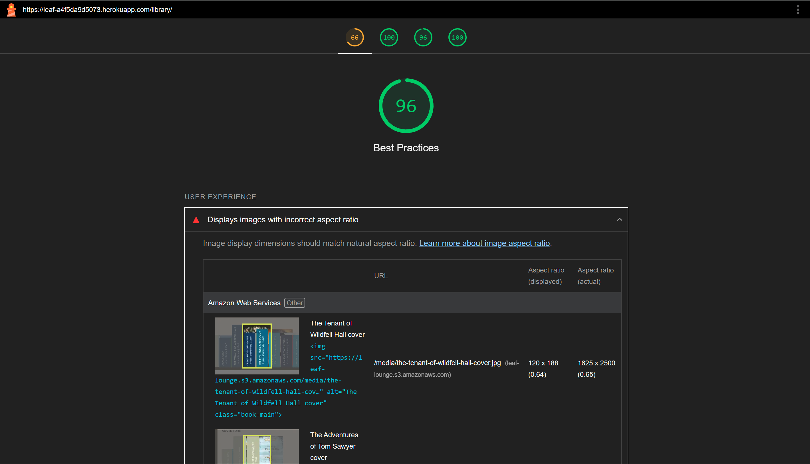
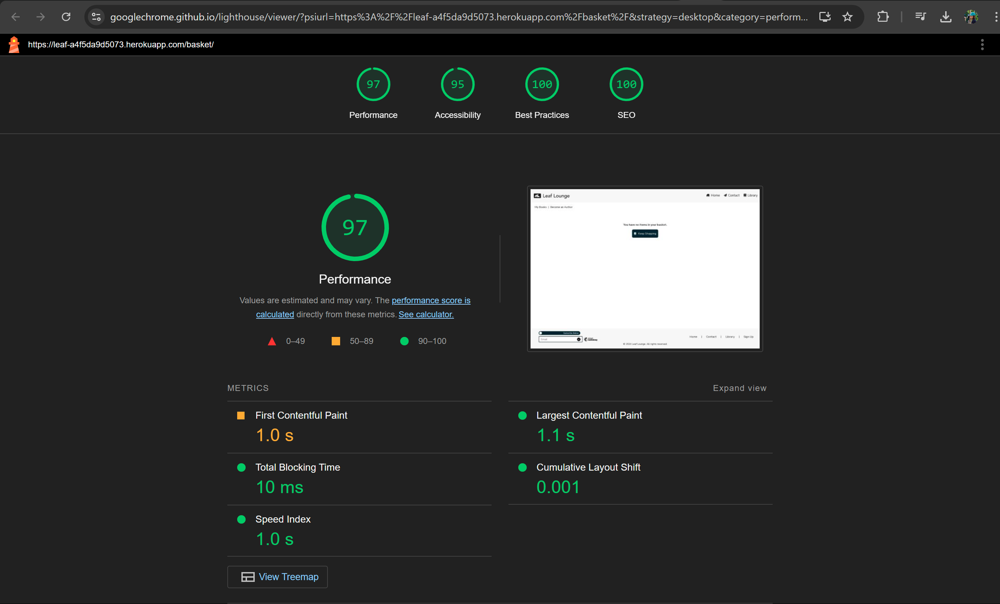
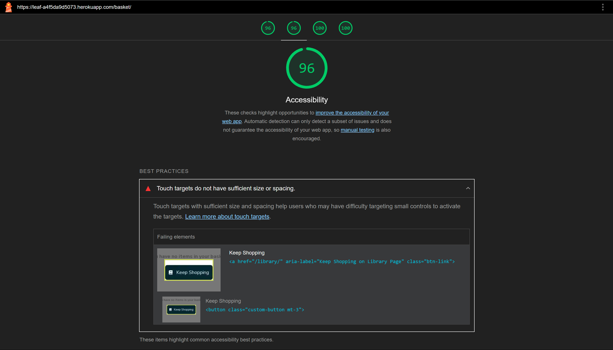

>>> ## Testing & Debugging
This section outlines procedures for manual testing. For automated testing, please see all files `test*.py`.

>> ### Manual Testing

> #### Home Page

| Feature | Expected Outcome | Testing Procedure | Result | Remark |
| ------- | ---------------- | ----------------- | ------ | ------ |
| jumbotron conditional displays | based on user authentication, display different headers in jumbotron + check displays on different screen sizes | Login + visual check/ logout + visual check/ login as admin + visual check | works as intended - less information on smaller screens, more on larger, admin header displays + typewriter message changes based on authentication |  |
| search bar | finds correct books + redirects to Library | query "Wuthering Heights" | works as intended - locates the correct book |  |
| social media | Opens a new page as per link | Click each | works as intended |  |
| subscribe/unsubscribe form | subscribe the email address to the mailing list, unsubscribe email address from the mailing list | manual subscribe/unsubscribe + check mailchimp mailing list | works as intended |  |
| all links | redirect to expected locations | manual testing | works as intended |  |

> #### Contact Page

| Feature | Expected Outcome | Testing Procedure | Result | Remark |
| ------- | ---------------- | ----------------- | ------ | ------ |
| contact page | sends valid queries to email | send query + check email for correct content and headers | works as intended, copy sent to registered business email + user email, does not send emails without all fields |  |


> #### Library Page

| Feature | Expected Outcome | Testing Procedure | Result | Remark |
| ------- | ---------------- | ----------------- | ------ | ------ |
| book shelves | display books by genre | visual check | books are correctly displayed by genre |  |
| book detail | onclick, takes users to dedicated book detail views | click on random books | works as intended |  |
| custom filters | show a row of books that match the filter parameters | select random | works as intended, shows a dedicated page where no books match the query, else, displays books in a book shelf |  |

> #### Basket

| Feature | Expected Outcome | Testing Procedure | Result | Remark |
| ------- | ---------------- | ----------------- | ------ | ------ |
| basket page | no items in basket = dedicated page + library button, items = item summary | with no books in basket, check the dedicated page displays with a working button to "keep shopping", add items to basket and check for a basket summary page | works as intended |  |

> #### Checkout

| Feature | Expected Outcome | Testing Procedure | Result | Remark |
| ------- | ---------------- | ----------------- | ------ | ------ |
| basket summary | display basket items in a summary table with relevant information | visual check | works as intended |  |
| dedicated checkout page | users can fill information, input payment details + select to save info to profile | manual check + check profile after submission | works as intended |  |
| success page | redirect users to success page with order confirmation, order summary + relevant buttons | manual check + logic check | works as intended |  |
| confirmation email | send order comfirmation email | go through checkout process + check for email | works as intended - email recieved |  |

> #### Become an Author

| Feature | Expected Outcome | Testing Procedure | Result | Remark |
| ------- | ---------------- | ----------------- | ------ | ------ |
| only registered users can access this functionality | redirects to sign up page | log out + manual check | works as intended |  |
| author form | displays a registration form + link to find existing account | manual check | works as intended - a success message pops up telling the user an associated profile has been located |  |
| book form | redirects to a book registration form if an author profile exists | manual check | works as intended - users may register their book |  |

> #### My Books

| Feature | Expected Outcome | Testing Procedure | Result | Remark |
| ------- | ---------------- | ----------------- | ------ | ------ |
| only registered users can access this functionality | redirects to sign up page | log out + manual check | works as intended |  |
| display purchased books | display user purchased books by genre | visual check | works as intended |  |
| display authored books | only displays authored books if the user has an associated author account | logic check | works as intended |  |
| genre filtering | only displays user purchased books from the selected genre | manual check | works as intended |  |
| leave a review | takes the user to a dedicated review form for reviewing a purchased book | manual check | works as intended |  |

> #### My Communities

| Feature | Expected Outcome | Testing Procedure | Result | Remark |
| ------- | ---------------- | ----------------- | ------ | ------ |
| general communities page | displays only the communities from which the user has purchased at least one book | manual check of purchased genres + logic in view | works as intended |  |
| specific community | onclick on one community from general communities page, takes the user into a dedicated community view | manual check | works as intended |  |
| specific community page | displays more books from genre + existing forums + form to create new forum | visual check | works as intended |  |
| create new forum | on inputting a forum name into the form, take user into forum chat | manual check | works as intended |  |
| chat | send messages, view other user messages + delete your own message | manual + visual check | works as intended |  |

> #### My Profile

| Feature | Expected Outcome | Testing Procedure | Result | Remark |
| ------- | ---------------- | ----------------- | ------ | ------ |
| table buttons | display relevant row based on button selection | manual check | works as intended |  |
| view reviews | under My reviews, view all user reviews | visual check | works as intended |  |
| approved reviews | after review approval, review should display under relevant book + take effect on over all book rating | visual check | works as intended |  |
| admin approval | as admin, be able to approve reviews from here | login as admin + check all reviews for the book display | works as intended |  |

>> ### Automated Testing
> ### Models (library app)
### `class TestibraryModels():`

A class for testing models in the Library app. Testing includes asserting equal values to those in the model setup, relational testing (including signal triggers) and basic validation.

Models: `Author`, `Genre`, `Book`, `Review`

`def setUp():`
```Python
    REGISTRATION:
        Simulates user registration to allow for the creation of a user profile and author profile.

    USER PROFILE & AUTHOR PROFILE:
        Retrieves the user profile automatically created following successful user registration. This is handled via reader.signals.create_or_save_profile.
        Simulates the creation of an author profile and assigns the relevant user profile to the author.user_profile field.

    GENRE & COMMUNITY:
        Simulates the creation of a genre. A community instance associated with the genre is created automatically via library.signals.create_community_on_genre_save.

    BOOK:
        Simulates the creation of a book with relevant relationships to the author and genre models.

    REVIEW:
        Simulates the creation of a review with relevant relationships to the user_profile and book models.

    Saves the relevant models to the test sqlite3 database.
```

`def test_author_profile_creation_and_validation():`

```Python
    Asserts the author user profile is the same as the current user's user profile.
    Asserts that an author profile can be blank (for authors uploaded via admin panel). For registering users, the author profile is created automatically.

    Asserts the author's first name matches the model's setup value.
    Asserts a ValidationError is raised if the author's firstname is empty.

    Asserts the author's last name matches the model's setup value.
    Asserts a ValidationError is raised if the author's lastname is empty.

    Asserts the author's d_o_b is a datetime object that matches the model's setup value.
    Asserts a ValidationError is raised if:
        - the author's d_o_b is of the wrong format - this is handled via a date input but just in case.
        - the author's d_o_b is empty.

    Asserts the author's nationality matches the model's setup value.
    Asserts the author's nationality can be blank.

    Asserts the author's bio matches the model's setup value.
    Asserts a ValidationError is raised if the author's bio is empty.
```

`def test_genre_and_genre_community_creation():`
```Python
    Retrieves the appropriate genre instance.
    Asserts the genre's **str**() returns the expected string for the appropriate genre instance.

    Asserts the genre name matches the model's setup value.
    Asserts a ValidationError is raised if the genre's name is empty.

    Asserts the genre's community field can be blank.
    Asserts the genre's community's name matches the expected value. A community instance is automatically created and linked following a new genre creation. This is handled via library.signals.~
```

`def test_book_creation():`
```Python
    Retrieves the appropriate book instance.
    Asserts the book's **str**() returns the expected string for the appropriate book instance.

    Asserts the book name matches the model's setup value.
    Asserts a ValidationError is raised if:
        - the book's name is empty.
        - the book's name is longer than 100 characters.

    Asserts the book isbn matches the model's setup value.
    Asserts a ValidationError is raised if
        - the book's isbn is empty.
        - the book's isbn is longer than 13 characters.

    Asserts a slug is automatically generated after a book instance is saved.

    Asserts the book author's firstname matches the model's setup value.
    Asserts a ValidationError is raised if there is no author.

    Asserts the book genre matches the model's setup value.
    Asserts a ValidationError is raised if there is no genre.

    Asserts the book blurb matches the model's setup value.
    Asserts a ValidationError is raised if the book's blurb is empty.

    Asserts the book's year_published field matches the model's setup value.
    Asserts a ValidationError is raised if
        - the book's year_published is of the wrong format.
        - the book's year_published is empty.
        - there is no year_published value.

    Asserts the book publisher matches the model's setup value.
    Asserts the book publisher can be empty.

    Asserts the book cover-type matches the model's setup value.
    Asserts a ValidationError is raised if
        - there is no cover-type value.
        - the book's cover-type is empty.

    Asserts the book's date_added field value is a datetime object that matches the model's setup value.
    Asserts a ValidationError is raised if
        - there is no date_added value.
        - the book's date_added is empty.
        - the book's date_added is of the wrong format.

    Asserts the book's price field is a Decimal format that matches the model's setup value.
    Asserts a ValidationError is raised if
        - the book's price is empty.
        - the book's price is over 5 decimals, i.e., a book's value is raised too high.
```

`def test_review_creation():`
```Python
    Retrieves the appropriate review instance for testing.
    Asserts the review's **str**() returns the expected string for the appropriate review instance.

    Asserts the reviewer is the user profile as per model setup.
    Asserts the user profile belongs to the user as per model setup.
    Asserts a ValidationError is raised if a review is without a reviewer.

    Asserts the book reviewed matches the model's setup value.
    Asserts a ValidationError is raised if there is no book title (no book) associated with the review.

    Asserts the review title matches the model's setup value.
    Asserts a ValidationError is raised if
        - the review title is empty.
        - the review title is over the 80 character limit as defined in models.py.

    Asserts the review rating matches the model's setup value.
    Asserts a ValidationError is raised if
        - there is no review rating.
        - the rating is over 10.
        - the rating is below 0.

    Asserts the review comment matches the model's setup value.
    Asserts a ValidationError is raised if there is no comment.

    Asserts today's (11-09-2024) date is automatically saved to the review's reviewed_on field.
    Asserts a validation error is raised if the reviewed_on date is missing.

    Asserts the newly saved review is saved as an unapproved instance.
```

> #### Model (community app)

### `class TestCommunityModel():`

A class for testing the community model. Testing includes asserting equal values to those in the model setup, save method testing, and format validation for datetime objects and slugs.

Fields: `Community`

`def setUp():`
```Python
    REGISTRATION:
        Simulates user registration to allow for users to access community-related functionality and models.

    GENRE & COMMUNITY:
        Simulates the creation of a genre. After the mock genre is saved, a community is automatically created.

    Saves the relevant models to the test sqlite3 database.
```

`def test_community_creation_following_genre_creation():`
```Python
    Retrieves the appropriate community instance for testing and saves it.
    This process generates the community slug as per the defined format.

    Asserts the community's __str__() returns the expected string for the appropriate community instance.

    Asserts the correct community is retrieved.
    Asserts a ValidationError is raised if
        - the community's name is empty.
        - there is no community name.
        - the community's name exceeds the 80 character limit.

    Asserts the community's description matches the model's setup value.

    Asserts the community's slug matches the expected slug string format.
    Asserts a ValidationError is thrown if the slug is inputted or generated in an incorrect format.
```

### `class TestForumAndMessageModels():`

A class for testing the forum and message models in the Community app.
Testing includes asserting equal values to those in the model setup, save method testing, user profile association, and format validation for datetime objects and slugs.

Fields: `Forum`, `Message`

`def setUp()`
```Python
    REGISTRATION:
        Simulates user registration to allow for the creation of a user profile.

    USER PROFILE & AUTHOR PROFILE:
        reate_or_save_profile.

    GENRE & COMMUNITY & FORUM:
        Simulates the creation of a genre. After the mock genre is saved, a community is automatically created. After the community is saved, forums can be created inside the community.
        Simulates the creation of a forum and saves it.

    MESSAGE:
        Simulates the creation of a message and saves it.

    Saves the relevant models to the test sqlite3 database.
```

`def test_forum_creation():`
```Python
    Retrieves the appropriate forum instance for testing.
    Asserts the forum's __str__() returns the expected string for the appropriate forum instance.

    Asserts the correct forum is retrieved by checking the name.
    Asserts a ValidationError is raised if
        - the forum's name is empty.
        - there is no forum name.
        - the forum's name exceeds the 80 character limit.

    Asserts the forum slug is automatically generated in the correct format after the instance is saved.
    Asserts a ValidationError is thrown if the slug is inputted or generated in an incorrect format.

    Asserts the forum's date_added matches today's date.
    Asserts a ValidationError is thrown if the date_added is does not match today's date.

    Asserts the forum is created inside the correct community by checking the name of the community.
```

`def test_message_creation():`
```Python
    Retrieves the appropriate message instance for testing.
    Asserts the message's __str__() returns the expected string for the appropriate message instance.

    Asserts the message is created inside the correct forum by checking its associated forum name.

    Asserts the message's content matches the model's setup value.
    Asserts a ValidationError is raised if
        - the message's content is empty.
        - there is no message content.

    Asserts the message sender matches the expected user profile.
    Asserts the message sender's username matches the expected value.

    Asserts the message's date_sent matches today's date.
    Asserts a ValidationError is thrown if the date_sent does not match today's date.
```

> ### Models (checkout app)
### `class TestCheckoutModels():`

A class for testing the order and booklineitem models in the checkout app.
Testing includes asserting equal values to those in the model setup, save method testing, and format validation for timezone objects and slugs.

Fields: `order`

`def setUp():`
```Python
    REGISTRATION:
        Simulates user registration to allow for the creation of a user profile.

    USER PROFILE & AUTHOR PROFILE:
        Retrieves the user profile automatically created following successful user registration. This is handled via reader.signals.create_or_save_profile.
        Simulates the creation of an author profile and assigns the relevant user profile to the author.user_profile field.

    GENRE & COMMUNITY:
        Simulates the creation of a genre.

    BOOK:
        Simulates the creation of a book with relevant relationships to the author and genre models.

    ORDER & BOOKLINEITEM:
        Simulates the creation of an order with no order number.
        Simulates the creation of a booklineitem, with relevant relationships to the order and book models. These models in turn depend on the genre, user profile, and author models.

    Saves the relevant models to the test sqlite3 database.
```

`def test_order_creation_and_string_fields():`
```Python
    Retrieves the appropriate order instance for testing.
    Asserts the order's __str__() returns the expected string for the appropriate order instance.

    Asserts order associated user profile matches the expected user profile.
    Asserts the order's user's username matches the expected value.

    Asserts the order's order number is not empty or None. This ensures that the model was saved and an order number was automatically generated and assigned.

    Asserts the order's associated user's full name matches the model's setup.
    Asserts a ValidationError is raised if:
        - the full_name field is empty.
        - there is no full_name value.
        - the full_name is longer than 50 characters.

    Asserts the order's associated email matches the model's setup.
    Asserts a ValidationError is raised if
        - the email field is empty.
        - there is no email value.
        - the email is of an unexpected format.

    Asserts the order's associated phone_number matches the model's setup.
    Asserts a ValidationError is raised if
        - the phone_number field is empty.
        - there is no phone_number value.
        - the phone_number is longer than 20 characters.

    Asserts the order's associated country matches the model's setup.
    Asserts a ValidationError is raised if
        - the country field is empty.
        - there is no country value.
        - the country is of an unexpected format.

    Asserts the order's associated postcode matches the model's setup.
    Asserts a ValidationError is raised if the postcode is of an unexpected format.

    Asserts the order's associated town_city matches the model's setup.
    Asserts a ValidationError is raised if
        - the town_city field is empty.
        - there is no town_city value.
        - the town_city is longer than 40 characters.

    Asserts the order's associated street_1 matches the model's setup.
    Asserts a ValidationError is raised if
        - the street_1 field is empty.
        - there is no street_1 value.
        - the street_1 is longer than 80 characters.

    Asserts the order's associated street_2 matches the model's setup.
    Asserts a ValidationError is raised if
        - the street_2 field is empty.
        - there is no street_2 value.
        - the street_2 is longer than 80 characters.

    Asserts the order's associated county matches the model's setup.
    Asserts a ValidationError is raised if the county is longer than 80 characters.
```

`def test_order_creation_and_decimal_fields():`
```Python
    Retrieves the appropriate order instance for testing.
    Asserts the order's __str__() returns the expected string for the appropriate order instance.

    Asserts the order's associated date matches the current date.
    Asserts a ValidationError is raised if:
        - the date field is empty.
        - there is no date value.

    Asserts the order's delivery_cost field is a Decimal format that matches the model's setup value.
    Asserts the delivery_cost cannot be null or empty.
    Asserts a ValidationError is raised if the delivery_cost is over 6 decimals, i.e., a book's value is raised too high, or is below 0.

    Asserts the order's order_total field is a Decimal format that matches the model's setup value.
    Asserts the order_total cannot be null or empty.
    Asserts a ValidationError is raised if the order_total is over 10 decimals, i.e., the order_total is raised too high, or is below 0.

    Asserts the order's grand_total field is a Decimal format that matches the model's setup value.
    Asserts the grand_total cannot be null or empty.
    Asserts a ValidationError is raised if the grand_total is over 10 decimals, i.e., the grand_total is raised too high, or is below 0.

    Asserts the order's original basket identifier matches the model's setup value.
    Asserts there must be an original_basket value.

    Asserts the order's associated stripe_pid matches the models's setup value.
    Asserts a ValidationError is raised if there is no stripe_pid or it is empty.
```

`def test_booklineitem_creation():`
```Python
    Retrieves the appropriate booklineitem instance for testing.
    Asserts the booklineitem's __str__() returns the expected string for the appropriate booklineitem instance.

    Asserts the booklineitem's order's user matches the appropriate user.
    Asserts the booklineitem's book matches the appropriate book.
    Asserts the booklineitem book type matches the model's set up and raises a ValidationError if there is no type or the type value is empty.

    Asserts the booklineitem quantity matches the model's set up and raises a ValidationError is there is no quantity, the quantity is under the minimum value of 1, or over the maximum value of 99.

    Asserts the booklineitem book_order_cost is calculated and saved correctly.
```

> ### Models (reader app)
### `class TestUserProfile():`

A class for testing models in the Reader app. Testing includes asserting a user profile is successfully created following user registration, and that the created user profile belongs to the registered user.

Models: `UserProfile`

`def setUp():`
```Python
    REGISTRATION:
        Simulates user registration to allow for the creation of a user profile.
```

`def test_user_profile_creation_on_user_registration():`
```Python
    Retrieves the appropriate user profile instance for testing.

    Asserts a user profile is successfully created following user registration.

    Asserts the user profile's __str__() returns the expected string for the appropriate user profile instance.
```


> ### Models (community app)
### `class TestCommunityModel(TestCase):`
A class for testing the community model. Testing includes asserting equal values to those in the model setup, save method testing, and format validation for datetime objects and slugs.

`def setUp():`
```Python
    REGISTRATION:
    Simulates user registration to allow for users to access community-related functionality and models.

    GENRE & COMMUNITY:
    Simulates the creation of a genre. After the mock genre is saved, a community is automatically created.

    Saves the relevant models to the test sqlite3 database.
```

`def test_community_creation_following_genre_creation():`
```Python
    Retrieves the appropriate community instance for testing and saves it.
    This process generates the community slug as per the defined format.

    Asserts the community's __str__() returns the expected string for the appropriate community instance.

    Asserts the correct community is retrieved.
    Asserts a ValidationError is raised if the community's name is empty.
    Asserts a ValidationError is raised if there is no community name.
    Asserts a ValidationError is raised if the community's name exceeds the 80 character limit.

    Asserts the community's description matches the model's setup value.

    Asserts the community's slug matches the expected slug string format.
    Asserts a ValidationError is thrown if the slug is inputted or generated in an incorrect format.
```

### `class TestForumAndMessageModels(TestCase):`
A class for testing the forum and message models in the Community app.
Testing includes asserting equal values to those in the model setup, save method testing, user profile association, and format validation for datetime objects and slugs.

`def setUp()`
```Python
    REGISTRATION:
    Simulates user registration to allow for the creation of a user
    profile.

    USER PROFILE & AUTHOR PROFILE:
    Retrieves the user profile automatically created following successful
    user registration. This is handled via
    reader.signals.create_or_save_profile.

    GENRE & COMMUNITY & FORUM:
    Simulates the creation of a genre. After the mock genre
    is saved, a community is automatically created. After
    the community is saved, forums can be created inside the
    community.
    Simulates the creation of a forum and saves it.

    MESSAGE:
    Simulates the creation of a message and saves it.

    Saves the relevant models to the test sqlite3 database.
```

`def test_forum_creation():`
```Python
    Retrieves the appropriate forum instance for testing.
    Asserts the forum's __str__() returns the expected string for the
    appropriate forum instance.

    Asserts the correct forum is retrieved by checking the name.
    Asserts a ValidationError is raised if the forum's name is empty.
    Asserts a ValidationError is raised if there is no forum name.
    Asserts a ValidationError is raised if the forum's name exceeds the
    100 character limit.

    Asserts the forum slug is automatically generated in the correct
    format after the instance is saved.
    Asserts a ValidationError is thrown if the slug is inputted or
    generated in an incorrect format.

    Asserts the forum's date_added matches today's date.
    Asserts a ValidationError is thrown if the date_added is does not match
    today's date.

    Asserts the forum is created inside the correct community by checking
    the name of the community.
```

`def test_message_creation():`
```Python
    Retrieves the appropriate message instance for testing.
    Asserts the message's __str__() returns the expected string for the
    appropriate message instance.

    Asserts the message is created inside the correct forum by checking
    its associated forum name.

    Asserts the message's content matches the model's setup value.
    Asserts a ValidationError is raised if the message's content is empty.
    Asserts a ValidationError is raised if there is no message content.

    Asserts the message sender matches the expected user profile.
    Asserts the message sender's username matches the expected value.

    Asserts the message's date_sent matches today's date.
    Asserts a ValidationError is thrown if the date_sent does not match
    today's date.
```


> ### URLS (basket app)
### `class TestBasketURLs():`
A class for testing URLs associated with the basket app. This class tests urls resolve from their FBVs and that certain views are allowed to handle DELETE requests.

`def test_basket_resolves():`
```Python
    Reverses the URL name and checks if it returns the correct FBV of basket.

    Asserts the basket view (basket) is resolved from 'basket'.
```

`def test_add_to_basket_resolves():`
```Python
    Reverses the URL name with arguments [int:book_id] and checks if it returns the correct FBV of add_basket.

    Asserts the view for adding items to basket (add_basket) is resolved from 'add_to_basket' with an int argument.
```

`def test_update_basket_resolves():`
```Python
    Reverses the URL name with arguments [int:book_id] and checks if it returns the correct FBV of amend_basket.

    Asserts the view for updating items in basket (amend_basket) is resolved from 'update_basket' with an int argument.
```

`def test_delete_from_basket_resolves():`
```Python
    Reverses the URL name with arguments [slug, int:book_id] and checks if it returns the correct FBV of delete_basket.

    Asserts the view for deleting items from basket (delete_basket) is resolved from 'delete_basket' with an int argument.

    Asserts the view is allowed to handle DELETE requests.
```

> ### URLS (blurb app)
### `class TestBlurbURLs():`
A class for testing URLs associated with the blurb app.

`def test_home_resolves():`
```Python
    Reverses the URL name and checks the correct FBV of blurb returns.
    Asserts the home view (blurb) is resolved from 'home'.
```

`def test_contact_resolves():`
```Python
    Reverses the URL name and checks the correct FBV of contact returns.
    Asserts the contact view (contact) is resolved from 'contact'.
```

> ### URLS (checkout app)
### `class TestCheckoutURLs():`

A class for testing URLs associated with the checkout app.
This class tests urls resolve from their FBVs.

`def test_checkout_resolves():`
```Python
    Reverses the URL name and checks if it returns the correct FBV of checkout.

    Asserts the checkout view (checkout) is resolved from 'checkout'.
```

`def test_success_resolves():`
```Python
    Reverses the URL name with arguments [str:order_number] and checks if it returns the correct FBV of success.

    Asserts the view called after successful checkout (success) is resolved from 'success' with a str argument of the order number.
```

> ### URLS (community app)
### `class TestCommunityURLs():`

A class for testing URLs associated with the community app.
This class tests urls resolve from their FBVs.

`def test_community_general_resolves():`
```Python
    Reverses the URL name and checks if it returns the correct FBV of community_general.

    Asserts the community general view (community) is resolved from 'communities'.
```

`def test_community_specific_resolves():`
```Python
    Reverses the URL name with arguments [slug:slug] and checks if it returns the correct FBV of community.

    Asserts specific community views (community) resolve from 'community' with slug arguments generated from the community name.
```

`def test_forum_detail_resolves():`
```Python
    Reverses the URL name with arguments [slug:slug] and checks if it returns the correct FBV of forum_detail.

    Asserts the genre-specific forum details (forum_detail) resolve from 'forum-detail' with slug arguments generated from the forum name.
```

`def test_author_registration_resolves():`
```Python
    Reverses the URL name and checks if it returns the correct FBV of create_author.

    Asserts the author registration view (create_author) is resolved from 'create_author'.
```

`def test_book_registration_resolves():`
```Python
    Reverses the URL name and checks if it returns the correct FBV of upload_book.

    Asserts the book upload/registration view (upload_book) is resolved from 'upload_book'.
```

`def test_delete_message_from_forum_resolves():`
```Python
    Reverses the URL name with arguments [slug:slug] and [int:id] and checks if it returns the correct FBV of delete_message.

    Asserts the view for deleting forum messages (delete_message) resolves from 'delete_message' with arguments of slug: forum name and int: message id.
```

> ### URLS (library app)
### `class TestLibraryURLs():`
A class for testing URLs associated with the library app.
This class tests urls resolve from their FBVs.

`def test_library_resolves():`
```Python
    Reverses the URL name and checks if it returns the correct FBV of library.

    Asserts the library view (library) is resolved from 'library'.
```

`def test_book_detail_resolves():`
```Python
    Reverses the URL name with arguments [slug:slug] and checks if it returns the correct FBV of book_detail.

    Asserts book detail views (book_detail) resolve from 'book-summary' with slug arguments generated from the book title and author last name.
```

> ### URLS (marketing app)
### `class TestMarketingURLs():`

A class for testing URLs associated with the marketing app.
This class tests urls resolve from their FBVs.

`def test_subscribe_resolves():`
```Python
    Reverses the URL name and checks if it returns the correct FBV of
    subscribe.

    Asserts the newsletter subscribe view (subscribe_view) resolves from
    'subscribe'.
```

`def test_unsubscribe_resolves():`
```Python
    Reverses the URL name and checks if it returns the correct FBV of
    unsubscribe.

    Asserts the newsletter unsubscribe view (unsubscribe_view) resolves
    from 'unsubscribe'.
```

> ### URLS (reader app)
### `class TestUserProfileURLs():`

A class for testing URLs associated with the reader app.
This class tests urls resolve from their FBVs.

`def test_user_profile_resolves():`
```Python
    Reverses the URL name and checks if it returns the correct FBV of
    my_profile.

    Asserts the user profile view (my_profile) resolves
    from 'user_profile'.
```

def test_user_books_resolves():
```Python
    Reverses the URL name and checks if it returns the correct FBV of
    my_books.

    Asserts the user book storage view (my_books) resolves
    from 'user_books'.
```

`def test_review_resolves():`
```Python
    Reverses the URL name and checks if it returns the correct FBV of
    leave_review.

    Asserts the view for leaving book reviews (leave_review) resolves
    from 'leave_review' with an int book id argument.
```

`def test_update_review_resolves():`
```Python
    Reverses the URL name and checks if it returns the correct FBV of
    update_review.

    Asserts the view for updating book reviews (update_review) resolves
    from 'update_review' with an int book id argument.
```

`def test_delete_review_resolves():`
```Python
    Reverses the URL name and checks if it returns the correct FBV of
    delete_review.

    Asserts the view for deleting book reviews (delete_review) resolves
    from 'delete_review' with an int book id argument.
```

`def test_unauthenticated_user_is_redirected():`
```Python
        Asserts unauthenticated users are redirected instead of allowing
        access to all views associated with the reader app, as per the
        @login_required decorator.
```

`def test_admin_approve_review_resolves():`
```Python
    Reverses the URL name and checks if it returns the correct FBV of
    approve_review.

    Asserts the view for admins to approve book reviews (approve_review) resolves
    from 'approve_review' with an int book id argument.
```

> ### Views (Basket App)
### `class TestBasketViews(TestCase):`

A class to test views associated with the Basket app. Testing scope
includes testing correct redirection, status codes and template usage.


`def setUp():`
```Python
    REGISTRATION:
        Simulates user registration to allow for users to create an
        author profile to allow for the creation of a book.

    USER & AUTHOR PROFILES:
        A user profile is created automatically following successful
        registration and retrieved. This profile is associated with
        an author profile.

    GENRE + BOOK:
        A test genre is created and assigned to the test book instance.
        This instance is used in the testing of URLs in POST requests.

    Saves the relevant models to the test sqlite3 database.
    Retrieves the relevant URLs and assigns them to variables for testing.
```

`def test_basket_get_request_is_retrieved():`
```Python
    Retrieves the basket URL and asserts the view renders successfully.
    Asserts the view status code is 200.
    Asserts the template used matches the expected template defined in
    views.py.
```

`def test_add_to_basket_post_request_is_retrieved():`
```Python
    Retrieves the add_to_basket URL and asserts the view handles post data.
    Asserts the view redirects after data handling.
    Asserts the client is redirected to the correct URL, correctly
    redirects and has a status code of 302 indicating redirection, a
    target status of 200 meaning the view is rendered correctly.
```

`def test_update_basket_post_request_is_resolved():`
```Python
    Retrieves the update_basket URL and asserts the view handles post data.
    Asserts the view redirects after data handling.
    Asserts the client is redirected to the correct URL, correctly
    redirects and has a status code of 302 indicating redirection, a target
    status of 200 meaning the view is rendered correctly.
```

`def test_delete_from_basket_post_request_is_resolved():`
```Python
    Retrieves the delete_from_basket URL and asserts the view handles
    post data.
    Asserts the view status code is 200.
```

> ### Views (Blurb App)
### `class TestBlurbViews(TestCase):`

A class to test views associated with the Blurb app. Testing scope
includes testing correct redirection, status codes and template usage.

`def setUp():`
```Python
    Retrieves the relevant URLs and assigns them to variables for testing.
```

`def test_home_page_is_retrieved():`
```Python
    Retrieves the home page URL and asserts the view renders successfully.
    Asserts the view status code is 200.
    Asserts the template used matches the expected template defined in
    views.py.
```

`def test_contact_page_get_request_is_retrieved():`
```Python
    Retrieves the contact page URL and asserts the view renders correctly.
    Asserts the view status code is 200.
    Asserts the template used matches the expected template defines in
    views.py
```

`def test_contact_page_post_request_is_successful():`
```Python
    Simulates form data passed to the contact view for testing a POST
    request.
    Asserts the client is redirected to the correct URL if the view receives
    correct contact form data, the view correctly redirects and has a status
    code of 302 indicating redirection, and a target status of 200 meaning
    the view is rendered correctly.
```

> ### Views (Checkout App)
### `class TestCheckoutViews(TestCase):`
A class to test views associated with the Checkout app. Testing scope includes testing correct redirection, status codes and template usage.

`def setUp():`
```Python
    REGISTRATION:
    Simulates user registration to allow for the creation of a user profile.

    USER PROFILE & AUTHOR PROFILE:
    Retrieves the user profile automatically created following successful user registration. This is handled via
    reader.signals.create_or_save_profile.
    Simulates the creation of an author profile and assigns the relevant user profile to the author.user_profile field.

    GENRE & COMMUNITY:
    Simulates the creation of a genre.

    BOOK:
    Simulates the creation of a book with relevant relationships to the author and genre models.

    ORDER & BOOKLINEITEM:
    Simulates the creation of an order with no order number.
    Simulates the creation of a booklineitem, with relevant relationships to the order and book models. These models in turn depend on the genre, user profile, and author models.

    Saves the relevant models to the test sqlite3 database.
    Retrieves the relevant URLs and assigns them to variables for testing.
```

`def test_checkout_get_request_no_basket_redirects():`
```Python
    Retrieves the checkout URL and asserts the view redirects to the library when there is no baslet (or no items) provided.
```

`def test_checkout_get_request_is_successful():`
```Python
    Sets up a mock session with a single book in the basket.
    Retrieves the checkout URL and asserts the view has a status code of 200 and renders with the expected template as defined in views.py
```

`def test_checkout_post_request_is_retrieved():`
```Python
    Retrieves the checkout URL and asserts the view handles POST requests.
    Asserts the view redirects (status code 302) post handling - the specific URL is not tested here as it takes a randomly generated order number for an argument. However, the actual view redirects to the correct URL.
```

`def test_success_get_request_is_successful():`
```Python
    Retrieves the success URL and asserts the view renders successfully.
    Asserts the view status code is 200.
    Asserts the template used matches the expected template defined in views.py.
```

> ### Views (Community App)
### `class TestCommunityViews(TestCase):`
A class for testing all views associated with the Community app. Testing scope includes testing correct redirection, status codes and template usage.

`def setUp():`
```Python
    REGISTRATION:
        Simulates user registration to allow for users to create anmauthor profile to allow for the creation of a book.

    USER & AUTHOR PROFILES:
        A user profile is created automatically following successful registration and retrieved. This profile is associated with an author profile.

    GENRE & COMMUNITY & FORUM:
        Simulates the creation of a genre. After the mock genre is saved, a community is automatically created. After the community is saved, forums can be created inside the community.
        Simulates the creation of a forum and saves it.

    MESSAGE:
        Simulates the creation of a message and saves it.

    Saves the relevant models to the test sqlite3 database.
    Retrieves the relevant URLs and assigns them to variables for testing.
```

`def test_communities_get_request_is_successful():`
```Python
    Retrieves the communities URL and asserts the view renders successfully.
    Asserts the status code is 200.
    Asserts the template used matches the expected template defined in views.py.
```

`def test_forum_get_request_is_successful():`
```Python
    Retrieves a specific forum URL and asserts the view renders successfully.
    Asserts the status code is 200.
    Asserts the template used matches the expected template defined in views.py.
```

`def test_forum_post_request_is_successful():`
```Python
    Retrieves the forum URL and asserts the view handles POST requests.
    Asserts the view redirects to the correct URL after a message is created, the status code is 302 signifying redirection, the status of the view being redirected to is 200, and that the redirection was performed correctly.
```

`def test_forum_message_deletion():`
```Python
    Retrieves the message_delete URL and asserts the view handles DELETE requests.
    Asserts the view redirects to the correct URL following deletion, the status code is 302 signifying redirection, the status of the view being redirected to is 200, and that the redirection was performed correctly.
```

`def test_create_author_get_request_is_successful():`
```Python
    Retrieves the create_author URL and asserts the view renders successfully.
    Asserts the status code is 200.
    Asserts the template used matches the expected template defined in views.py.
```

`def test_create_author_post_request_is_successful():`
```Python
    Retrieves the create_author URL and asserts the view handles POST requests.
    Asserts the view redirects to the correct URL - the upload_book URL through which new book instances are created, the status code is 302 signifying redirection, the status of the view being redirected to is 200, and that the redirection was performed correctly.
```

> ### Views (Library App)
### `class TestLibraryViews(TestCase):`
A class for testing all views associated with the Library app.Testing scope includes testing correct redirection, status codes and template usage.

`def setUp():`
```Python
    REGISTRATION:
        Simulates user registration to allow for users to create an
        author profile to allow for the creation of a book.

    USER & AUTHOR PROFILES:
        A user profile is created automatically following successful
        registration and retrieved. This profile is associated with
        an author profile.

    GENRE + BOOK:
        A test genre is created and assigned to the test book instance.
        This instance is used in the testing of URLs in POST requests.

    Saves the relevant models to the test sqlite3 database.
    Retrieves the relevant URLs and assigns them to variables for testing.
```

`def test_library_q_get_request_is_successful():`
```Python
    Retrieves the library URL with a request for a specific keyword
    to be included in the book title (via search bar) and asserts
    the view renders successfully.
    Asserts the template used matches the expected template defined in
    views.py.
```

`def test_library_author_get_request_is_successful():`
```Python
    Retrieves the library URL with a request for a specific author
    (via filters) and asserts the view renders successfully.
    Asserts the view status code is 200.
    Asserts the template used matches the expected template defined in
    views.py.
```

`def test_library_genre_get_request_is_successful():`
```Python
    Retrieves the library URL with a request for a specific genre
    (via filters) and asserts the view renders successfully.
    Asserts the view status code is 200.
    Asserts the template used matches the expected template defined in
    views.py.
```

`def test_book_detail_get_request_is_successful():`
```Python
    Retrieves the book detail URL with a book slug argument and asserts
    the view renders successfully.
    Asserts the view status code is 200.
    Asserts the template used matches the expected template defined in
    views.py.
```

> ### Views (Marketing App)
### `class TestMarketingViews(TestCase):`
A class to test views associated with the Marketing app. Testing scope includes testing correct redirection and redirection status codes.

`def setUp():`
```Python
    Retrieves the relevant URLs and assigns them to variables for testing.
```

`def test_subscribe_post_request_is_successful():`
```Python
    Simulates form data passed to the subscribe form for testing a POST request.
    Asserts the client is redirected to the correct URL if the view receives correct form data, the view correctly redirects and has a status code of 302 indicating redirection, and a target status of 200 meaning the view is rendered correctly.
```

`def test_unsubscribe_post_request_is_successful():`
```Python
    Simulates form data passed to the unsubscribe form for testing a POST request.
    Asserts the client is redirected to the correct URL if the view receives correct form data, the view correctly redirects and has a status code of 302 indicating redirection, and a target status of 200 meaning the view is rendered correctly.
```

> ### Views (Reader App)
### `class TestReaderViews(TestCase):`
A class for testing all views associated with the Reader app. Testing scope includes testing correct redirection, status codes and template usage. These views allow users to access their profile, purchased books, CRUD functionality for reviews, and for admins to approve pending reviews.

`def setUp():`
```Python
    REGISTRATION:
        Simulates user registration to allow for users to create an
        author profile to allow for the creation of a book.

    USER & AUTHOR PROFILES:
        A user profile is created automatically following successful
        registration and retrieved. This profile is associated with
        an author profile.

    GENRE + BOOK:
        A test genre is created and assigned to the test book instance.
        This instance is used in the testing of URLs in POST requests.

    REVIEW:
        A test review is created for testing URLs for creating, deleting
        and updating reviews. The creaeted user profile and book are
        associated with this instance.

    Saves the relevant models to the test sqlite3 database.
    Retrieves the relevant URLs and assigns them to variables for testing.
```

`def test_my_profile_get_request_is_successful():`
```Python
    Retrieves the profile URL and asserts the view renders successfully.
    Asserts the status code is 200.
    Asserts the template used matches the expected template defined in
    views.py.
```

`def test_my_profile_post_request_is_successful():`
```Python
    Retrieves the profile URL and posts user address data to it.
    Asserts the view accepts POST data, redirects to the correct URL, the
    status code is 302 signifying redirection, the status of the view being
    redirected to is 200, the correct message comes up, and that the
    redirection was performed correctly.
```

`def test_user_books_get_request_is_successful():`
```Python
    Retrieves the user_books URL and asserts the view renders successfully.
    Asserts the status code is 200.
    Asserts the template used matches the expected template defined in
    views.py.
```

`def test_user_books_get_specific_genre_request_is_successful():`
```Python
    Retrieves the user_books URL and asserts the view renders successfully.
    Asserts the status code is 200.
    Asserts the template used matches the expected template defined in
    views.py.
```

`def test_review_page_get_request_is_successful():`
```Python
    Retrieves the leave_review URL with an argument of a book id, and
    asserts the view renders successfully.
    Asserts the status code is 200.
    Asserts the template used matches the expected template defined in
    views.py.
```

`def test_user_can_leave_a_review():`
```Python
    Retrieves the leave_review URL.
    Asserts the view accepts POST data, redirects to the correct URL, the
    status code is 302 signifying redirection, the status of the view being
    redirected to is 200, and that the redirection was performed correctly.
```

`def test_delete_review():`
```Python
    Retrieves the delete_review URL and provides the review id for the
    review to be deleted.
    Asserts the view accepts DELETE data, redirects to the correct URL,
    the status code is 302 signifying redirection, the status of the view
    being redirected to is 200, the correct message comes up, and that the
    redirection was performed correctly.
```

`def test_update_review_get_request_is_successful():`
```Python
    Retrieves the update_review URL and provides the id of the review for
    updating.
    Asserts the view redirects to the user profile page if a GET request
    is made. This view only handles POST requests.
```

`def test_update_review_post_request_is_successful():`
```Python
    Retrieves the update_review URL and provides the id of the review for
    updating.
    Asserts the view accepts POST data, redirects to the correct URL,
    the status code is 302 signifying redirection, the status of the view
    being redirected to is 200, and that the redirection was performed
    correctly.
```

`def test_approve_review_is_successful():`
```Python
    Retrieves the approve_review URL and provides the id of the review for
    updating.
    The permissions for this review (admin access only) are handled by
    views.py
    Asserts the view accepts POST data, redirects to the correct URL, the
    status code is 302 signifying redirection, the status of the view being
    redirected to is 200, and that the redirection was performed correctly.
```

> ### Forms (Blurb App)
### `class TestContactForm(TestCase):`
A class for testing the Contact Form associated with the Blurb app.
This form allows users to contact the Leaf Lounge team with queries.

`def test_contact_for_name_is_required():`
```Python
    Asserts the contact form is invalid without a name value.
    Asserts the error raised as a result of the empty value stems
    from the "name" key.
    Asserts the error raises matches the expected error.
```

`def test_contact_form_email_is_required():`
```Python
    Asserts the contact form is invalid without an email value.
    Asserts the error raised as a result of the empty value stems
    from the "email" key.
    Asserts the error raises matches the expected error.
```

`def test_contact_form_email_format_is_correct():`
```Python
    Asserts the contact form is invalid if the email value is of
    an incorrect format.
    Asserts the error raised as a result of the incorrectly-formatted
    value stems from the "email" key.
    Asserts the error raises matches the expected error.
```

`def test_contact_form_subject_is_required():`
```Python
    Asserts the contact form is invalid without a subject value.
    Asserts the error raised as a result of the empty value stems
    from the "subject" key.
    Asserts the error raises matches the expected error.
```

`def test_contact_form_message_is_required():`
```Python
    Asserts the contact form is invalid without a message value.
    Asserts the error raised as a result of the empty value stems
    from the "message" key.
    Asserts the error raises matches the expected error.
```

`def test_correctly_filled_form_is_valid():`
```Python
    Asserts a correctly filled form is valid.
```

> ### Forms (Checkout App)
### `class TestOrderForm(TestCase):`
A class for testing the Order Form associated with the Checkout app.
This form allows users to place orders by specifying their billing address.

`def test_order_form_name_is_required():`
```Python
    Asserts the order form is invalid without a full_name value.
    Asserts the error raised as a result of the empty value stems from the "full_name" key.
    Asserts the error raises matches the expected error.
```

`def test_order_form_email_is_required():`
```Python
    Asserts the order form is invalid without an email value.
    Asserts the error raised as a result of the empty value stems from the "email" key.
    Asserts the error raises matches the expected error.
```

`def test_order_form_email_format_is_correct():`
```Python
    Asserts the contact form is invalid if the email value is of an incorrect format.
    Asserts the error raised as a result of the incorrectly-formatted value stems from the "email" key.
    Asserts the error raises matches the expected error.
```

`def test_order_form_phone_number_is_required():`
```Python
    Asserts the order form is invalid without a phone_number value.
    Asserts the error raised as a result of the empty value stems from the "phone_number" key.
    Asserts the error raises matches the expected error.
```

`def test_order_form_street_1_is_required():`
```Python
    Asserts the contact form is invalid without a street_1 value.
    Asserts the error raised as a result of the empty value stems from the "street_1" key.
    Asserts the error raises matches the expected error.
```

`def test_order_form_street_2_is_not_required():`
```Python
    Asserts the contact form is valid if there is no street_2 value provided by the user at checkout.
```

`def test_order_form_town_city_is_required():`
```Python
    Asserts the contact form is invalid without a town_city value.
    Asserts the error raised as a result of the empty value stems from the "town_city" key.
    Asserts the error raises matches the expected error.
```

`def test_order_form_postcode_is_not_required():`
```Python
    Asserts the contact form is valid if there is no postcode value provided by the user at checkout.
```

`def test_order_form_county_is_not_required():`
```Python
    Asserts the contact form is valid if there is no county value provided by the user at checkout.
```

`def test_order_form_country_is_required():`
```Python
    Asserts the contact form is invalid without a country value.
    Asserts the error raised as a result of the empty value stems from the "country" key.
    Asserts the error raises matches the expected error.
```

`def test_order_form_country_must_be_predefined():`
```Python
    Asserts the contact form is invalid with an incorrect value.
    Asserts the error raised as a result of the incorrect value stems from the "country" key.
    Asserts the error raises matches the expected error.
```

`def test_fully_and_correctly_filled_form_is_valid():`
```Python
    Asserts an order form instance that is full and correctly filled out is valid.
```

`def test_partially_but_correctly_filled_form_is_valid():`
```Python
    Asserts an order form instance that is partially but correctly filled out is valid.
```

> ### Forms (Community App)
### `class TestAuthorForm(TestCase):`
"""
A class for testing the Author Form associated with the community app.
This form allows registered users to create an Author Profile account so that they can register and upload books onto the Leaf Lounge website.

`def setUp():`
```Python
    REGISTRATION:
        Simulates user registration to allow for the creation of a user profile.

    USER PROFILE & AUTHOR PROFILE:
        Retrieves the user profile automatically created following successful user registration. This is handled via reader.signals.create_or_save_profile.
        Simulates the creation of an author profile and assigns the relevant user profile to the author.user_profile field.

    Saves the relevant models to the test sqlite3 database.
```

`def test_user_profile_is_not_required():`
```Python
    Asserts an Author profile can be created without an associated user profile - this is specifically for authors uploaded via the admin panel. This is not representative of authors created by Leaf Lounge users.
```

`def test_first_name_is_required():`
```Python
    Asserts the author form is invalid with an empty first_name value.
    Asserts the error raised as a result of the incorrect value stems from the "first_name" key.
    Asserts the error raises matches the expected error.
```

`def test_last_name_is_required():`
```Python
    Asserts the author form is invalid with an empty last_name value.
    Asserts the error raised as a result of the incorrect value stems from the "last_name" key.
    Asserts the error raises matches the expected error.
```

`def test_d_o_b_is_required():`
```Python
    Asserts the author form is invalid with an empty d_o_b value.
    Asserts the error raised as a result of the incorrect value stems from the "d_o_b" key.
    Asserts the error raises matches the expected error.
```

`def test_d_o_b_must_be_correct_format():`
```Python
    Asserts the author form is invalid with an incorrectly formatted d_o_b value, which should follow YYYY-MM-DD.
    Asserts the error raised as a result of the incorrect value stems from the "d_o_b" key.
    Asserts the error raises matches the expected error. The formatting of this is handled automatically via the form. This test checks bad user injection.
```

`def test_nationality_is_not_required():`
```Python
    Asserts the author form is valid even if no value for the Nationality was provided.
```

`def test_bio_is_required():`
```Python
    Asserts the author form is invalid with an empty bio value.
    Asserts the error raised as a result of the incorrect value stems from the "bio" key.
    Asserts the error raises matches the expected error.
```

`def test_fully_and_correctly_filled_form_is_valid():`
```Python
    Asserts the author form is valid when all information is provided.
```

### `class TestBookForm(TestCase):`
A class for testing the Book Registration Form associated with the community app.
This form allows registered users with associated profile accounts to register their books. These books can be viewed under "My Books" in the secondary navigation bar.

`def setUp():`
```Python
    REGISTRATION:
        Simulates user registration to allow for the creation of a user profile.

    USER PROFILE & AUTHOR PROFILE:
        Retrieves the user profile automatically created following
        successful user registration. This is handled via reader.signals.create_or_save_profile.
        Simulates the creation of an author profile and assigns the relevant user profile to the author.user_profile field.

    GENRE & COMMUNITY:
        Simulates the creation of a genre.

    Saves the relevant models to the test sqlite3 database.
```

`def missing_field_assertion():`
```Python
    A helper function used for running assertion tests for missing values in form fields.

    Arguments:
    value: str - the form field being tested.
    form: obj - the form being tested.
```

`def test_book_form_title_is_required():`
```Python
    Asserts the book form is invalid with an empty title value.
    Asserts the error raised as a result of the incorrect value stems from the "title" key.
    Asserts the error raises matches the expected error.
```

`def test_book_form_isbn_is_required():`
```Python
    Asserts the book form is invalid with an empty isbn value.
    Asserts the error raised as a result of the incorrect value stems from the "isbn" key.
    Asserts the error raises matches the expected error.
```

`def test_book_form_blurb_is_required():`
```Python
    Asserts the book form is invalid with an empty blurb value.
    Asserts the error raised as a result of the incorrect value stems from the "blurb" key.
    Asserts the error raises matches the expected error.
```

`def test_book_form_genre_is_required():`
```Python
    Asserts the book form is invalid with an empty genre value.
    Asserts the error raised as a result of the incorrect value stems from the "genre" key.
    Asserts the error raises matches the expected error.
```

`def test_book_form_year_published_is_not_required():`
```Python
    Asserts the book form is valid without a year_published value.
```

`def test_book_form_publisher_is_not_required():`
```Python
    Asserts the book form is valid without a publisher value.
```

`def test_book_form_type_is_required():`
```Python
    Asserts the book form is invalid with an empty type value.
    Asserts the error raised as a result of the incorrect value stems from the "type" key.
    Asserts the error raises matches the expected error.
```

`def test_book_form_type_must_be_one_of_predefined():`
```Python
    Asserts the book form is invalid with an incorrect type value.
    Asserts the error raised as a result of the incorrect value stems from the "type" key.
    Asserts the error raises matches the expected error.
```

`def test_book_form_price_is_required():`
```Python
    Asserts the book form is invalid with an empty price value.
    Asserts the error raised as a result of the incorrect value stems from the "price" key.
    Asserts the error raises matches the expected error.
```

`def test_book_form_price_must_be_under_5_digits():`
```Python
    Asserts the book form is invalid if a price value over 5 digits is provided for books.
    Asserts the error raised as a result of the incorrect value stems from the "price" key.
    Asserts the error raises matches the expected error.
```

`def test_test_correctly_filled_form_is_valid():`
```Python
    Asserts a correctly filled form is valid.
```

### `class TestForumForm(TestCase):`
A class for testing the Forum form associated with the community app.
This form allows users to create chat forums within genre communities.

`def test_forum_form_name_is_required():`
```Python
    Asserts the forum form is invalid with an empty name value.
    Asserts the error raised as a result of the incorrect value stems from the "name" key.
    Asserts the error raises matches the expected error.
```

`def test_filled_forum_form_is_valid():`
```Python
    Asserts a correctly filled form is valid.
```

### `class TestMessageForm(TestCase):`
A class for testing the Message form associated with the community app.
This form allows users to send messages within forums.

`def test_forum_form_name_is_required():`
```Python
    Asserts the message form is invalid with an empty content value.
    Asserts the error raised as a result of the incorrect value stems from the "content" key.
    Asserts the error raises matches the expected error.
```

`def test_filled_message_form_is_valid():`
```Python
    Asserts a correctly filled form is valid.
```

> ### Forms (Marketing App)
### `class TestNewsletterForm(TestCase):`
A class for testing the Newsletter Form associated with the Marketing app.
This form allows users to sign up to the Leaf Lounge Newsletter powered by Mailchimp.

`def test_newsletter_form_email_is_required():`
```Python
    Asserts the newsletter form is invalid without an email value.
    Asserts the error raised as a result of the empty value stems from the "email" key.
    Asserts the error raises matches the expected error.
```

`def test_newsletter_form_email_format_is_correct():`
```Python
    Asserts the newsletter form is invalid if the email value is of an incorrect format.
    Asserts the error raised as a result of the incorrectly-formatted value stems from the "email" key.
    Asserts the error raises matches the expected error.
```

`def test_correctly_filled_form_is_valid():`
```Python
    Asserts a correctly filled form is valid.
```

> ### Forms (Reader App)
### `class TestUserProfileForm(TestCase):`
A class for testing the UserProfile Form associated with the reader app.
This form allows users to streamline the checkout process by pre-filling their information on the checkout page.

`def test_user_profile_form_information_is_not_required():`
```Python
    Asserts the user profile form is valid even if there is no information provided. These fields are optional.
```

`def test_fully_and_correctly_filled_form_is_valid():`
```Python
    Asserts the user profile form is valid with all information provided.
    These fields are optional, but are used for faster checkout processes.
```

`def test_partially_but_correctly_filled_form_is_valid():`
```Python
    Asserts the user profile form is valid with partial information provided.
    These fields are optional, but are used for faster checkout processes.
```

### `class TestReviewForm(TestCase):`
A class for testing the Review Form associated with the reader app.
This form allows users leave reviews on books they have purchased. This form can be accessed through "My Books" > "Leave a Review", and all pending and approved reviews can be viewed under "My Profile" > "My Reviews".

`def setUp():`
```Python
    REGISTRATION:
        Simulates user registration to allow for the creation of a user
        profile.

    USER PROFILE & AUTHOR PROFILE:
        Retrieves the user profile automatically created following successful user registration. This is handled via reader.signals.create_or_save_profile.
        Simulates the creation of an author profile and assigns the relevant user profile to the author.user_profile field.

    GENRE & COMMUNITY:
        Simulates the creation of a genre.

    BOOK:
        Simulates the creation of a book with relevant relationships to the author and genre models. This is required as reviews need a valid book instance.

    Saves the relevant models to the test sqlite3 database.
    Retrieves the relevant URLs and assigns them to variables for testing.
```

`def test_review_form_book_is_required():`
```Python
    Asserts the review form is invalid with an empty book value.
    Asserts the error raised as a result of the incorrect value stems from the "book" key.
    Asserts the error raises matches the expected error.
```

`def test_review_form_book_must_be_valid():`
```Python
    Asserts the review form is invalid with an incorrect book value.
    This means a value that does not reference a book in the database.
    Asserts the error raised as a result of the incorrect value stems from the "book" key.
    Asserts the error raises matches the expected error.
```

`def test_review_form_title_is_required():`
```Python
    Asserts the review form is invalid with an empty title value.
    Asserts the error raised as a result of the incorrect value stems from the "title" key.
    Asserts the error raises matches the expected error.
```

`def test_review_form_rating_is_required():`
```Python
    Asserts the review form is invalid with an empty rating value.
    Asserts the error raised as a result of the incorrect value stems from the "rating" key.
    Asserts the error raises matches the expected error.
```

`def test_review_form_rating_must_be_more_than__or_equal_1():`
```Python
    Asserts the review form is invalid with a rating value <1.
    Asserts the error raised as a result of the incorrect value stems from the "rating" key.
    Asserts the error raises matches the expected error.
```

`def test_review_form_rating_must_be_less_than_or_equal_10():`
```Python
    Asserts the review form is invalid with a rating value >10.
    Asserts the error raised as a result of the incorrect value stems from the "rating" key.
    Asserts the error raises matches the expected error.
```

`def test_review_form_comment_is_required():`
```Python
    Asserts the review form is invalid with an empty comment value.
    Asserts the error raised as a result of the incorrect value stems from the "comment" key.
    Asserts the error raises matches the expected error.
```

`def test_review_form_is_valid():`
```Python
    Asserts a review form instance that is full and correctly filled out is valid.
```


>>> ## Issues
1. #### Contact Page `ConnectionRefusedError`
   
   The error was encountered when attempting to send emails from the contact page. Instead of redirecting users to the home page with a success message, the application would throw the 500 Server Error page, and the email wouldn't reach the recipients' addresses.

> #### Solution
The issue was down to a simple typo in the following line in `blurb/views.py`: `recipient_list=[settings.EMAIL_HOST_USER, f'{email}'],` - the misplaced comma at the end. This syntax rendered the `recipient_list` as an invalid value in the `send_mail()` method, thus throwing the method and redirecting users to the 500 server error page. Removing the comma and saving the file resolved this issue. Testing and eventual resolution were done in `VS Code` by cloning the repository and debugging the relevant code due to Gitpod permissions and limitations.

>>> ## Accessibility & Performance

>> #### Lighthouse
- `Home Page`


- `Contact Page`



- `Library Page`



- `Basket Page`



- `Sign Up Page`


>> #### HTML Validation

>> #### CSS Validation

>> #### JSHint Validation
All js files are regularly validated during development using [JSHint](https://jshint.com/).

>> #### Pep8 Validation
All python files are regularly validated during development using the [Code Institute PEP8 Linter](https://pep8ci.herokuapp.com/).
